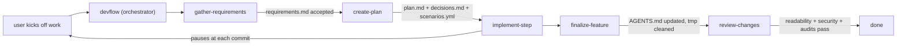

# AGENTS.md — how to work in this repo

This file tells any coding agent (Claude, Codex, Cursor, Gemini, Copilot, etc.) how to
navigate and contribute to `devflow`.

## What this repo is

`devflow` is a collection of [Agent Skills](https://agentskills.io/specification) that
encode a phase-based coding workflow: **gather-requirements → create-plan → implement-step →
finalize-feature → review-changes**, coordinated by a thin `devflow` orchestrator skill.

The repo itself is built using the same workflow — it dogfoods its own skills.

## Ground rules for agents working here

1. **Do not edit accepted requirements in place.** Requirements under
   `docs/features/<slug>/requirements.md` are immutable once marked `status: accepted`. The only
   legal way to change prior behavior is to author a new requirement with
   `supersedes: [REQ-xxxx]` and regenerate `.devflow/state.yml`.

2. **Run code early and often.** Prefer a temp script you delete later over a long
   speculative edit loop. Temp scripts live under `tmp/` and must be cleaned up in the
   `finalize-feature` step.

3. **Pause at commit boundaries.** Each plan step ends at a commit point. Stop, summarize what
   was done and why, and wait for the engineer to review before proceeding.

4. **If the plan conflicts with reality, stop and escalate.** Do not silently work around the
   plan. Update `plan.md`, `decisions.md`, and any affected entries in `scenarios.yml`
   first, then resume.

5. **SOLID (subset):** favor Single Responsibility, Open/Closed, and Dependency Inversion in
   any code produced by `implement-step`.

6. **Keep each `SKILL.md` under ~500 lines.** Push detail to `references/`. The Agent Skills
   spec is deliberately designed around [progressive
   disclosure](https://agentskills.io/specification#progressive-disclosure) — respect it.

## Repository layout

```
devflow/
├── skills/                          # skills installed by the skills CLI
│   ├── devflow/                    # orchestrator (Phase 0)
│   ├── gather-requirements/         # Phase 1
│   ├── create-plan/                 # Phase 2
│   ├── implement-step/              # Phase 3
│   ├── finalize-feature/            # Phase 4
│   └── review-changes/              # Phase 5
├── examples/
│   └── <sample-feature>/            # dogfood artifacts (requirements / plan / scenarios)
├── AGENTS.md                        # this file
├── CLAUDE.md                        # pointer to AGENTS.md for Claude Code
├── README.md                        # human-facing overview + install
└── LICENSE                          # MIT
```

Every skill directory follows the Agent Skills format:

```
<skill-name>/
├── SKILL.md            # required, includes YAML frontmatter (name + description)
├── references/         # optional, loaded on demand
├── scripts/            # optional
└── assets/             # optional
```

## Phase routing



Intent triggers in each skill's frontmatter `description` route the agent into the right
phase. The orchestrator hands off; it does not re-implement phase behavior.

## Requirements-as-migrations (short version)

- Requirements carry monotonic IDs: `REQ-0001`, `REQ-0002`, …
- Each requirements file ends with a machine-readable `deltas:` YAML block listing
  `adds` / `modifies` / `removes` / `supersedes`.
- `.devflow/state.yml` is the accumulated system contract, deterministically rebuilt from the
  ordered acceptance log. It is checked in so PRs show contract drift.
- Before acceptance, `gather-requirements` dry-runs the delta and runs Tier 1 (structural) and
  Tier 2 (declarative state / budget / dependency) conflict checks. If anything conflicts, the
  user resolves via **amend draft**, **supersede prior**, or **reject draft**.
- `review-changes` runs a **state-drift audit** that fails hard if the checked-in
  `.devflow/state.yml` disagrees with a re-fold of the acceptance log.

The full rules live in [`skills/gather-requirements/references/`](./skills/gather-requirements/references).

## scenarios.yml — behavior catalog (short version)

Each feature has a `scenarios.yml` file that lists scenarios as structured entries. Each
entry has a narrative `description`, traceability tags, and — once Phase 3 runs — a
`tests:` list pointing to one or more tests (unit, integration, contract, load, smoke,
e2e) in the consumer repo's native test framework. Scenarios are the spec; tests are the
proof. See
[`skills/create-plan/references/scenarios-schema.md`](./skills/create-plan/references/scenarios-schema.md).

Vocabulary v1 (tags live under `tags:` on each scenario entry):

- **Traceability:** `req: [REQ-0017, REQ-0018]`, `plan_step: 3`, `decision: [DEC-0004]`, `owner: <handle>`
- **Lifecycle:** `status: spec-only | tests-written | passing | flaky | deferred`
- **Run matrix:** `env: [local, ci]`, `browser: [chromium, firefox]`, `platform: [linux]`

Scenario-level fields (outside `tags:`): `pause_after`, `assumes`, `locked`, `examples`.

## Development status

This repo is under active development. The planned step sequence:

- [x] Step 1: scaffold
- [x] Step 2: `devflow` orchestrator skill
- [x] Step 3: `gather-requirements` skill (+ conflict-detection, state-file, supersede-protocol references)
- [x] Step 4: `create-plan` skill (+ scenarios.yml schema references)
- [x] Step 5: `implement-step` skill (+ TDD loop, SOLID, pause-points)
- [x] Step 6: `finalize-feature` skill (+ handoff checklist)
- [x] Step 7: `review-changes` skill (+ audit machinery, readability, security, review report)
- [ ] Step 8: CI validation + finalized README catalog
- [ ] Step 9: Dogfood on a URL-shortener sample under `examples/`

Each step ends at a reviewable commit.

### Resume note for the next session

Last commit on `main`: `ff3b8c8` — `rename dev-flow → devflow`. Working tree clean.

**Next up — Step 8: CI validation + finalized README catalog + install instructions.** Scope:

1. **Skill metadata validation in CI.** A GitHub Actions workflow that validates every
   `skills/*/SKILL.md` frontmatter against the [Agent Skills specification](https://agentskills.io/specification)
   (required keys: `name`, `description`; optional: `license`, `metadata`). If `skills-ref`
   is available on npm, use it; otherwise write a short Node or Python validator committed
   under `scripts/` (follow the run-discipline contract). Runs on every push and PR.
2. **Markdown link check (optional but cheap).** Lychee or markdown-link-check on every
   `.md` in the repo. Guards against rot as references multiply.
3. **Mermaid syntax check (optional).** `@mermaid-js/mermaid-cli --parse` over every
   fenced `mermaid` block. Also cheap, also worth it — we have a lot of diagrams.
4. **Finalized `README.md` catalog.** The per-skill description section with correct
   install commands now that the rename has landed (`npx skills add ksolo/devflow`,
   plus per-skill additions where the user wants only a subset). Link each catalog
   entry to its `SKILL.md` for easy navigation.
5. **`CHANGELOG.md`.** Start one — entry `0.1.0` covers Steps 1–7 and the rename.
6. **Pre-push / pre-commit hints (optional).** A single-line note in `AGENTS.md` /
   `CLAUDE.md` pointing at the validator command for agents to run before committing.

Step 8 does NOT add new skills or change workflow behavior. It's plumbing and
distribution. After it lands, Step 9 dogfoods the whole pipeline on a URL-shortener
sample under `examples/`.

Recommended first action for the resuming session: read this file, then
`skills/devflow/SKILL.md`, then proceed.

## Contributing

1. Start a new feature with the `gather-requirements` skill (dogfood the workflow).
2. Keep each `SKILL.md` ≤ 500 lines; push detail to `references/`.
3. Validate skill metadata locally with `npx skills-ref validate skills/<name>` before committing
   (CI will enforce this once Step 8 lands).

## License

[MIT](./LICENSE).
