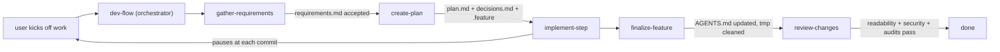

# AGENTS.md — how to work in this repo

This file tells any coding agent (Claude, Codex, Cursor, Gemini, Copilot, etc.) how to
navigate and contribute to `dev-flow`.

## What this repo is

`dev-flow` is a collection of [Agent Skills](https://agentskills.io/specification) that
encode a phase-based coding workflow: **gather-requirements → create-plan → implement-step →
finalize-feature → review-changes**, coordinated by a thin `dev-flow` orchestrator skill.

The repo itself is built using the same workflow — it dogfoods its own skills.

## Ground rules for agents working here

1. **Do not edit accepted requirements in place.** Requirements under
   `docs/features/<slug>/requirements.md` are immutable once marked `status: accepted`. The only
   legal way to change prior behavior is to author a new requirement with
   `supersedes: [REQ-xxxx]` and regenerate `.dev-flow/state.yml`.

2. **Run code early and often.** Prefer a temp script you delete later over a long
   speculative edit loop. Temp scripts live under `tmp/` and must be cleaned up in the
   `finalize-feature` step.

3. **Pause at commit boundaries.** Each plan step ends at a commit point. Stop, summarize what
   was done and why, and wait for the engineer to review before proceeding.

4. **If the plan conflicts with reality, stop and escalate.** Do not silently work around the
   plan. Update `plan.md`, `decisions.md`, and any affected `.feature` scenarios first, then
   resume.

5. **SOLID (subset):** favor Single Responsibility, Open/Closed, and Dependency Inversion in
   any code produced by `implement-step`.

6. **Keep each `SKILL.md` under ~500 lines.** Push detail to `references/`. The Agent Skills
   spec is deliberately designed around [progressive
   disclosure](https://agentskills.io/specification#progressive-disclosure) — respect it.

## Repository layout

```
dev-flow/
├── skills/                          # skills installed by the skills CLI
│   ├── dev-flow/                    # orchestrator (Phase 0)
│   ├── gather-requirements/         # Phase 1
│   ├── create-plan/                 # Phase 2
│   ├── implement-step/              # Phase 3
│   ├── finalize-feature/            # Phase 4
│   └── review-changes/              # Phase 5
├── examples/
│   └── <sample-feature>/            # dogfood artifacts (requirements / plan / .feature)
├── AGENTS.md                        # this file
├── CLAUDE.md                        # pointer to AGENTS.md for Claude Code
├── README.md                        # human-facing overview + install
└── LICENSE                          # MIT
```

Every skill directory follows the Agent Skills format:

```
<skill-name>/
├── SKILL.md            # required, includes YAML frontmatter (name + description)
├── references/         # optional, loaded on demand
├── scripts/            # optional
└── assets/             # optional
```

## Phase routing



Intent triggers in each skill's frontmatter `description` route the agent into the right
phase. The orchestrator hands off; it does not re-implement phase behavior.

## Requirements-as-migrations (short version)

- Requirements carry monotonic IDs: `REQ-0001`, `REQ-0002`, …
- Each requirements file ends with a machine-readable `deltas:` YAML block listing
  `adds` / `modifies` / `removes` / `supersedes`.
- `.dev-flow/state.yml` is the accumulated system contract, deterministically rebuilt from the
  ordered acceptance log. It is checked in so PRs show contract drift.
- Before acceptance, `gather-requirements` dry-runs the delta and runs Tier 1 (structural) and
  Tier 2 (declarative state / budget / dependency) conflict checks. If anything conflicts, the
  user resolves via **amend draft**, **supersede prior**, or **reject draft**.
- `review-changes` runs a **state-drift audit** that fails hard if the checked-in
  `.dev-flow/state.yml` disagrees with a re-fold of the acceptance log.

The full rules live in [`skills/gather-requirements/references/`](./skills/gather-requirements/references).

## Extended Gherkin (short version)

`.feature` files are valid Gherkin supersets. Extensions live in tags and are guided (warned,
not enforced). See
[`skills/create-plan/references/gherkin-extensions.md`](./skills/create-plan/references/gherkin-extensions.md)
once built. Vocabulary v1:

- **Traceability:** `@req:REQ-0017,REQ-0018`, `@plan-step:3`, `@decision:DEC-0004`, `@feature:<slug>`, `@owner:<team>`
- **Lifecycle:** `@status:spec-only | step-def-written | passing | flaky | deferred`
- **Run matrix:** `@env:local,ci`, `@browser:chromium,firefox`, `@platform:linux`
- **Agent control:** `@locked`, `@pause-after`, `@assumes:<slug>`

## Development status

This repo is under active development. The planned step sequence:

- [x] Step 1: scaffold (this commit)
- [ ] Step 2: `dev-flow` orchestrator skill
- [ ] Step 3: `gather-requirements` skill (+ conflict-detection, state-file, supersede-protocol references)
- [ ] Step 4: `create-plan` skill (+ Gherkin extension references)
- [ ] Step 5: `implement-step` skill (+ TDD loop, SOLID, pause-points)
- [ ] Step 6: `finalize-feature` skill (+ handoff checklist)
- [ ] Step 7: `review-changes` skill (+ readability / security / BDD-tag / state-drift audits)
- [ ] Step 8: CI validation + finalized README catalog
- [ ] Step 9: Dogfood on a URL-shortener sample under `examples/`

Each step ends at a reviewable commit.

## Contributing

1. Start a new feature with the `gather-requirements` skill (dogfood the workflow).
2. Keep each `SKILL.md` ≤ 500 lines; push detail to `references/`.
3. Validate skill metadata locally with `npx skills-ref validate skills/<name>` before committing
   (CI will enforce this once Step 8 lands).

## License

[MIT](./LICENSE).
