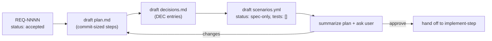

# create-plan — Phase 2

Your job is to turn an **accepted requirement** into three artifacts that Phase 3 can execute
mechanically:

1. `plan.md` — an ordered list of commit-sized steps, each with its own verification.
2. `decisions.md` — the architectural decisions this plan embodies, recorded as short ADRs.
3. `scenarios.yml` — a structured catalog of behavioral scenarios, each linking to one or
   more supporting tests (written in Phase 3). Scenarios are the spec; tests are the proof.

## Golden rules

1. **Commit-sized steps.** Each step is one reviewable commit. If a step can't be described
   in 3-4 sentences of "what changes and why", it's too big — split it.
2. **Every step has verification.** "How do we know this step works" is mandatory. Prefer
   executable verification (a test run, a curl, a script output) over "looks right".
3. **Mermaid for anything non-trivial.** Data flow, state transitions, sequence interactions,
   component structure — use diagrams. See
   [`references/mermaid-patterns.md`](references/mermaid-patterns.md).
4. **Every significant choice becomes a DEC-xxxx entry.** If you're picking between two
   sensible options, record it. If you're picking an existing pattern, name the pattern and
   link to the example.
5. **Scenarios up front.** Every acceptance criterion in the requirement becomes a scenario
   entry in `scenarios.yml` before Phase 3 starts, at `status: spec-only` with `tests: []`.
6. **No code, no tests.** This phase produces specifications and plans only. Phase 3 writes
   the tests and implementation.

## The lifecycle

## What to do, step by step

### 1. Read the requirement

Open `docs/features/<slug>/requirements.md`. Confirm `status: accepted`. If it isn't, stop
and route back to `gather-requirements`. Read:

- All functional requirements and acceptance criteria (these map 1:1 to scenarios).
- The `deltas:` block (capabilities, actors, rules, budgets drive the plan's dependencies).
- The non-functional requirements (they become verification conditions and may drive a
  dedicated scenario with `kind: load` / `kind: security` tests).
- Any `supersedes:` — if this replaces prior REQs, prior scenarios tagged
  `req: [REQ-xxxx]` may need to be deleted, updated, or relocated.

### 2. Draft `plan.md`

Copy [`references/plan-template.md`](references/plan-template.md) to
`docs/features/<slug>/plan.md`. Fill every section.

Rules for steps:

- **Number them monotonically** (1, 2, 3, …). Steps don't get IDs; the commit title carries
  the step number.
- **Each step is commit-sized.** If you need "and also" to describe it, split.
- **Each step names** (a) what files change, (b) what behavior changes, (c) verification.
- **Every step references at least one scenario** from `scenarios.yml` by `id`. Steps
  without a scenario are infrastructure prep and must be explicitly flagged as such.
- **Mermaid mandatory** for: architecture (flowchart), sequences with multiple actors
  (sequenceDiagram), lifecycle with transitions (stateDiagram-v2).

### 3. Draft `decisions.md`

Copy [`references/decisions-template.md`](references/decisions-template.md). Create a
`decisions.md` in the feature directory if it doesn't exist, or append to an existing one.

Every plan step that makes a non-obvious choice should link to a DEC entry. A DEC entry is
short (1 page max) and answers: **context, considered options, decision, consequences,
status**.

Look at existing `decisions.md` files in sibling features to harvest **existing patterns**
in the codebase. See
[`references/design-patterns-cheatsheet.md`](references/design-patterns-cheatsheet.md) for
prompts to find them. Re-using an existing pattern is a valid decision — record it with
"reuses DEC-xxxx from feature: <other-slug>".

### 4. Draft `scenarios.yml`

Copy [`references/scenarios-template.yml`](references/scenarios-template.yml) to
`docs/features/<slug>/scenarios.yml`. Create one scenario entry per acceptance criterion
from the requirement.

Apply the **v1 tag vocabulary**. See
[`references/scenarios-schema.md`](references/scenarios-schema.md) for the schema. At
minimum each scenario needs:

- `id` — unique kebab-case within the file.
- `title` — one-line summary.
- `tags.req: [REQ-NNNN, ...]` — which requirement's acceptance criterion does this cover?
- `tags.plan_step: N` — which plan step implements this scenario?
- `tags.status: spec-only` — start every scenario at spec-only. Phase 3 advances the
  status.
- `description` — free-form narrative of the expected behavior. Given/When/Then phrasing
  is recommended but not enforced.
- `tests: []` — empty at this phase. Phase 3 will populate.

Useful optional fields:

- `tags.decision: [DEC-NNNN]` — when a scenario embodies a specific decision (e.g. a
  security check driven by a recorded decision).
- `tags.env: [ci]`, `tags.platform: [linux]`, etc. — when the scenario is
  environment-specific.
- `pause_after: true` — put this on the last scenario of each plan step so Phase 3 stops
  for review after implementing that step.
- `assumes: [<slug>]` — when the scenario depends on an assumption recorded in
  `decisions.md` that could invalidate the plan if broken.
- `examples: [...]` — Scenario-Outline equivalent for data-driven scenarios.

**Do not set `locked: true`.** That's a user promise applied only by the engineer after
explicit approval.

**Do not write tests yet.** `tests: []` is correct for this phase. Phase 3 adds entries
as it writes them.

### 5. Summarize and hand off

Produce a short summary:

- Count of plan steps and the rough effort shape (e.g. "7 steps: 2 infra, 4 feature, 1 perf").
- List of DEC entries created.
- Count of scenarios written and which are gated by `pause_after: true`.
- Anything in the requirement that the plan **does not** cover (should be rare — flag if so).

Ask the engineer to review before handing off. If approved:

1. Update `.devflow/session.yml`: `phase: implement-step`, `current_plan_step: 1`.
2. Hand off to `implement-step` with the handoff line:

   > Plan for **REQ-NNNN** (`<slug>`) ready: 7 steps, 4 DEC entries, 9 scenarios (3 paused).
   > Handing off to `implement-step` starting at step 1.

## Conflict-with-plan escalation (applies during Phase 3, documented here)

If during Phase 3 (`implement-step`) reality contradicts the plan, the agent there is
instructed to **stop and escalate**. When that happens the workflow re-enters **this** skill
to update `plan.md`, `decisions.md`, and any affected scenarios. Treat the update like a new
planning pass — do not mutate in place without recording why. Add a "Revision <n>" section to
`plan.md` with the rationale and the diff summary.

## References

- [`references/plan-template.md`](references/plan-template.md) — the plan.md template.
- [`references/decisions-template.md`](references/decisions-template.md) — ADR-lite template.
- [`references/scenarios-template.yml`](references/scenarios-template.yml) — annotated scenarios.yml.
- [`references/scenarios-schema.md`](references/scenarios-schema.md) — schema + tag vocabulary.
- [`references/status-lifecycle.md`](references/status-lifecycle.md) — `status` transitions + TDD coupling.
- [`references/traceability.md`](references/traceability.md) — `req`/`plan_step`/`decision` + `tests:` wiring.
- [`references/mermaid-patterns.md`](references/mermaid-patterns.md) — Mermaid snippet library.
- [`references/design-patterns-cheatsheet.md`](references/design-patterns-cheatsheet.md) — prompts to find/reuse patterns.
