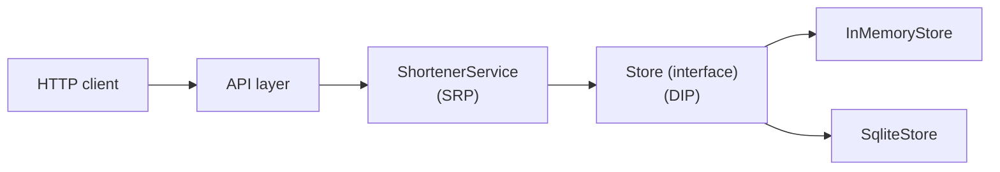
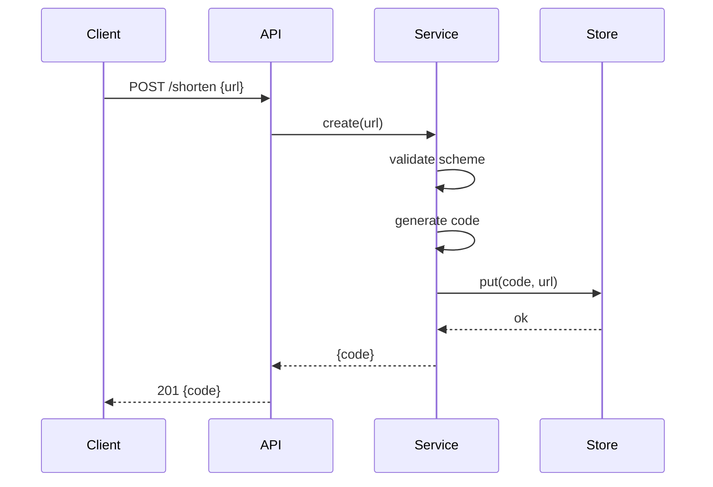
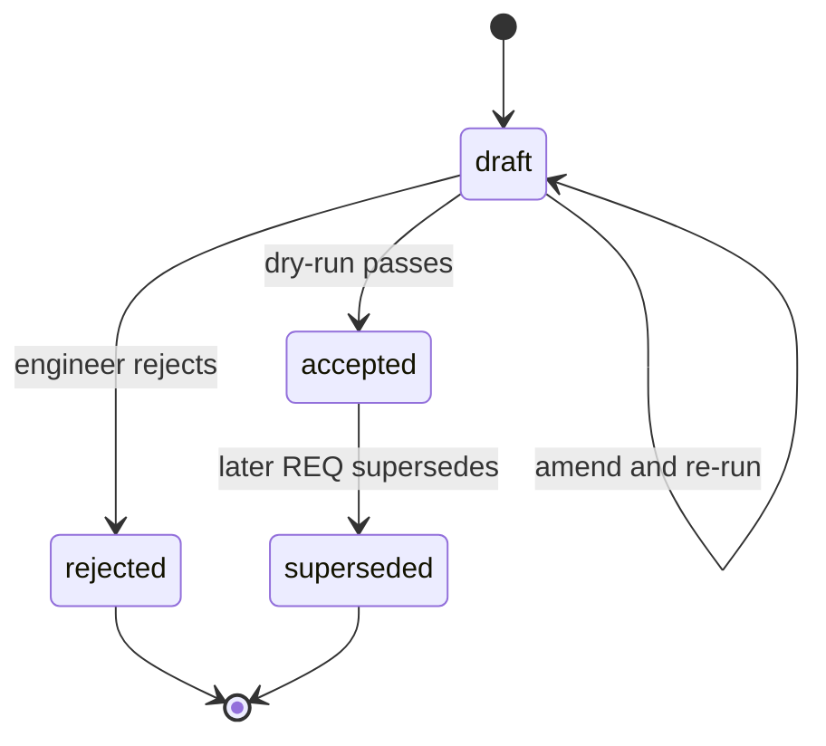
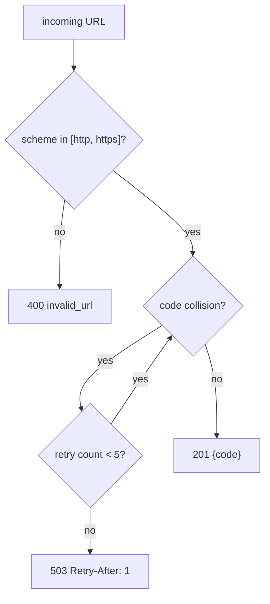
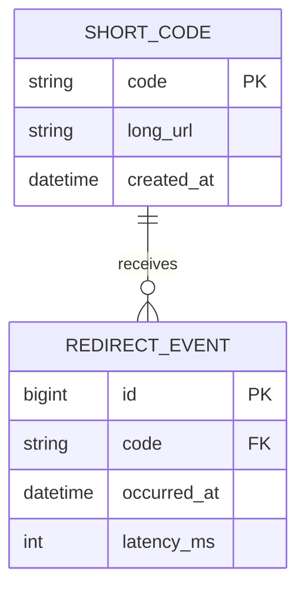
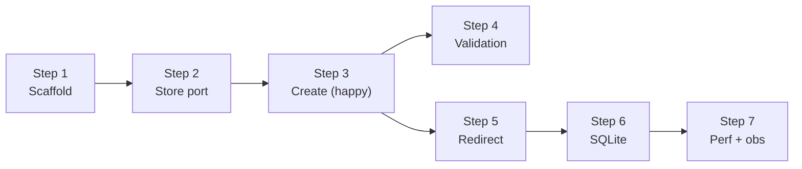
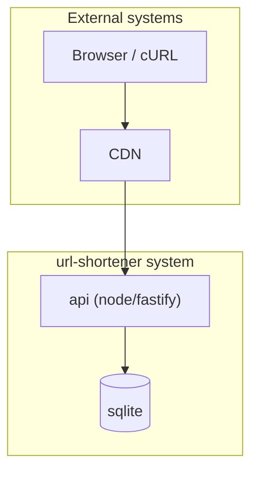
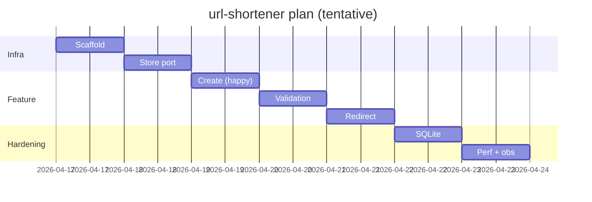

# Mermaid patterns

A small library of Mermaid diagrams to copy into plans, decisions, and requirements.

Rules of engagement:

- **No spaces in node ids.** Use camelCase, PascalCase, or underscores.
- **Quote node labels** with parentheses, brackets, colons, or commas.
- **No explicit colors.** Let the renderer apply theme colors (dark-mode safe).
- **Avoid reserved words** as node ids (`end`, `subgraph`, `graph`, `flowchart`).
- **Click events are disabled.** Don't use `click` syntax.

Source of truth for syntax: [Mermaid docs](https://mermaid.js.org/).

## Architecture (flowchart LR)

For showing component boundaries and dependency direction. Use Left-to-Right for a request
path; Top-to-Bottom for a layered architecture.

## Sequence (request with multiple actors)

For showing the order of interactions between components or services.

## State transitions

For lifecycles: `@status` progression, order states, subscription states, entity
lifecycles.

## Decision trees

For showing which branch is taken based on conditions.

## ER (entity-relationship)

For data models.

## Pipeline / dependency graph

For plan steps with dependencies, CI pipelines, data pipelines.

## C4 container view (system context)

For wider architecture discussions spanning multiple services or external systems.

## Gantt-style step timing (optional)

Use sparingly — plans are commit-sized, so hard timing usually isn't meaningful. Keep for
when the engineer explicitly asks to estimate.

## Choosing a diagram

| When | Use |
|---|---|
| Components / dependencies with direction | flowchart LR or TB |
| Time-ordered interactions across actors | sequenceDiagram |
| Something transitions between named states | stateDiagram-v2 |
| Condition-driven branching | flowchart TD with diamond nodes |
| Data model | erDiagram |
| Step dependencies / CI pipeline | flowchart LR |
| System context, multiple containers | flowchart with subgraphs (poor-man's C4) |
| Timing estimates (rare) | gantt |

## One diagram per topic

A plan with one good flowchart beats a plan with five mediocre ones. If a diagram would be
clearer as prose, use prose.
