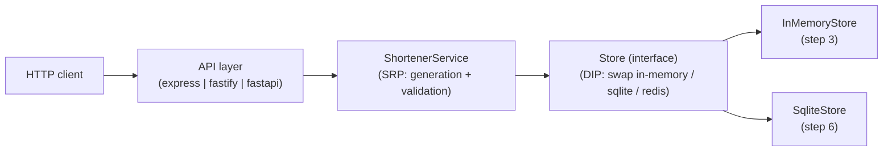

# Plan template

Copy the block below to `docs/features/<slug>/plan.md`. Fill every section. Keep it tight —
the plan is a contract between Phase 2 and Phase 3, not a design doc.

---

````markdown
---
feature: url-shortener
for_requirement: REQ-0042
created_at: 2026-04-16T17:00:00Z
author: kevin
status: draft                 # draft | approved | revised
revision: 1
---

# Plan — url-shortener (REQ-0042)

## Summary

<!-- 2-3 sentences. What's being built and why, in plain language. -->

Implement a small URL shortener API with a create endpoint and a redirect endpoint. Seven
commit-sized steps, 4 architectural decisions, 9 scenarios in `scenarios.yml`. First two
steps are infra (repo layout + persistence contract); the rest deliver user-visible
behavior.

## Architecture



References:
- Decisions: [decisions.md](decisions.md) (DEC-0001..DEC-0004)
- Scenarios: [scenarios.yml](scenarios.yml)

## Steps

Each step ends at a reviewable commit. The commit title should be
`step N: <what-changed>` for the feature branch.

### Step 1 — Scaffold project structure

- **Changes:** create `src/`, `tests/`, `package.json` (or `pyproject.toml`), linter config,
  formatter config, empty `ShortenerService` interface stub.
- **Why:** establishes the file layout so subsequent steps have somewhere to land.
- **Scenarios covered:** none (infrastructure step — flagged as such).
- **Verification:** `npm test` (or equivalent) runs with 0 tests and exits 0. Linter runs
  clean on the empty project.
- **Decisions:** DEC-0001 (runtime/language), DEC-0002 (layout).

### Step 2 — Define the Store port and InMemoryStore

- **Changes:** interface `Store { put, get }`; first implementation `InMemoryStore`; unit
  tests proving round-trip and collision behavior.
- **Why:** DIP — the service never knows about the concrete store. Lets us swap to SQLite in
  step 6 without touching the service.
- **Scenarios covered:** none directly (dependency for later scenarios).
- **Verification:** `npm test -- stores/` passes. Every method on the interface has at least
  one test.
- **Decisions:** DEC-0003 (in-memory first, persistence later).

### Step 3 — Create short code for a valid URL (happy path)

- **Changes:** `ShortenerService.create(longUrl)` returns a 7-char base62 code; API POST
  route; wires service to InMemoryStore.
- **Why:** first slice of user-visible behavior — vertical cut from API to store.
- **Scenarios covered:**
  - `valid-https-returns-201` (`plan_step: 3`, `pause_after: true`). Tests: one
    integration test on `POST /shorten`, one unit test on the code generator.
- **Verification:**
  1. Populate the scenario's `tests:` list and write the tests (expect red).
  2. Implement `ShortenerService.create` and the route until all tests are green.
  3. Advance `tags.status` from `tests-written` to `passing`.
  4. `curl -X POST localhost:3000/shorten -d '{"url":"https://example.com"}'` returns 201.
- **Decisions:** DEC-0004 (base62 + 7 chars).

### Step 4 — Reject invalid schemes

- **Changes:** validation in `ShortenerService.create` rejecting non-http(s) schemes; 400
  response shape.
- **Why:** security posture (per REQ-0042 non-functional: no `javascript:`, `data:`,
  `file:`).
- **Scenarios covered:**
  - `disallowed-schemes-rejected` (`plan_step: 4`; uses `examples:` for the rejected
    schemes). Tests: one integration test per scheme + a unit test on the validator.
- **Verification:** all tests in the scenario's `tests:` list green; scenario advances
  to `status: passing`.

### Step 5 — Redirect endpoint

- **Changes:** GET `/:code` route; uses `ShortenerService.resolve(code)`; 302 on hit, 404
  on miss.
- **Why:** second half of the user-visible behavior.
- **Scenarios covered:**
  - `redirect-known-code-302` (`plan_step: 5`).
  - `redirect-unknown-code-404` (`plan_step: 5`, `pause_after: true`).
- **Verification:**
  1. Write the integration tests for both scenarios (expect red).
  2. Implement `resolve` and the route until green.
  3. Advance both scenarios to `status: passing`.
  4. Manual `curl -I localhost:3000/<code>` shows `302 Location: <long url>`.

### Step 6 — SQLite persistence

- **Changes:** `SqliteStore` implementing the `Store` interface; migration script;
  application config switch.
- **Why:** persistence across restart. DIP means no service changes required.
- **Scenarios covered:** re-run existing scenarios with `tags.env: [ci]` — they all still pass
  against the SqliteStore backend.
- **Verification:**
  1. `npm run migrate` creates the schema.
  2. All existing scenarios pass against `SqliteStore` (swap via env var).
  3. Restart the process and confirm a previously-created code still resolves.
- **Decisions:** DEC-0005 (sqlite over sqlite-compat ORMs).

### Step 7 — Perf scenario + observability

- **Changes:** structured logging (short_code, long_url_hash, latency, outcome); load test
  script under `tmp/` (to be removed in finalize).
- **Why:** non-functional: p95 < 150ms under 100 rps, observability per REQ-0042.
- **Scenarios covered:**
  - `redirect-perf-p95-150ms` (`plan_step: 7`, `tags.env: [ci]`, `pause_after: true`).
    Tests: one `kind: load` autocannon-based script under `tests/load/`.
- **Verification:**
  1. Run the load test against the running server, capture metrics.
  2. Confirm p95 latency reported by the test is < 150ms.
  3. Confirm log lines contain the required fields.
  4. Advance scenario to `status: passing`.

## Coverage check

| Acceptance criterion (REQ-0042) | scenarios.yml id | Plan step |
|---|---|---|
| 1 — valid HTTPS returns 201 + 7-char code | `valid-https-returns-201` | 3 |
| 2 — visit returns 302 | `redirect-known-code-302` | 5 |
| 3 — unknown returns 404 | `redirect-unknown-code-404` | 5 |
| 4 — javascript: returns 400 | `disallowed-schemes-rejected` | 4 |
| 5 — p95 < 150ms at 100 rps | `redirect-perf-p95-150ms` | 7 |

All five acceptance criteria covered. No uncovered criteria.

## Out-of-scope for this plan

- Any UI (per REQ-0042 out-of-scope).
- Custom vanity codes.
- Link expiry.

## Revision log

| Revision | Date | Summary |
|---|---|---|
| 1 | 2026-04-16 | Initial plan. |
````

---

## Filling guidance

- **Step size:** if "what changes" needs more than 3 bullets, split the step.
- **Verification:** at least one line that a human could copy-paste and run. "Tests pass"
  alone is not enough — say *which* tests.
- **Coverage check is mandatory.** Acceptance-criterion-to-scenario-to-step table. If any
  criterion doesn't map, either add a scenario or flag explicitly as out-of-plan with a
  reason.
- **Mermaid early.** Even a rough architecture flowchart at the top pays for itself in
  agent context.
- **Revision log** is how we keep the commit-sized discipline during Phase 3 escalations —
  see the "conflict-with-plan escalation" section of
  [`../SKILL.md`](../SKILL.md#conflict-with-plan-escalation-applies-during-phase-3-documented-here).
