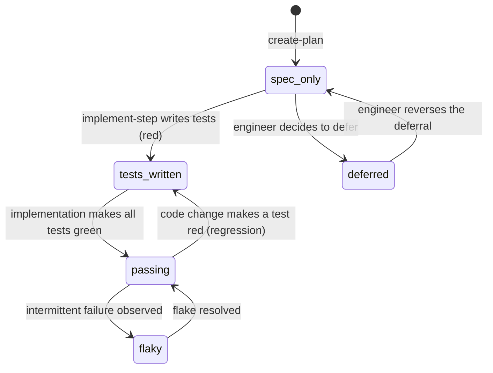
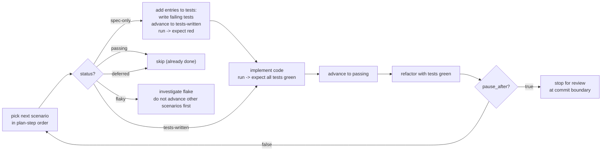

# `status` lifecycle

Every scenario in `scenarios.yml` carries exactly one `tags.status` value. The status
drives Phase 3 (`implement-step`) decisions and Phase 5 (`review-changes`) audits.

## Values

| Value | Meaning |
|---|---|
| `spec-only` | Scenario authored. `tests:` list is empty. No tests exist yet. |
| `tests-written` | `tests:` list is populated. Tests exist but at least one is red. |
| `passing` | Every test in `tests:` is green in the latest CI run. |
| `flaky` | Quarantined. Rare; requires an inline YAML comment explaining the flake. |
| `deferred` | Intentionally not implemented yet. Requires a comment linking a follow-up REQ or issue. |

## Transition diagram



`[*]` → `spec_only` is the only legal authoring path. `create-plan` **always** writes new
scenarios at `status: spec-only` with an empty `tests:` list.

## TDD coupling

Phase 3 follows a strict red → green → refactor loop keyed to `status`:



## Authoring rules

### In `create-plan` (Phase 2)

- New scenarios: always `status: spec-only` with empty `tests:` list.
- Never write `tests-written`, `passing`, `flaky`, or `deferred` from this phase.

### In `implement-step` (Phase 3)

- Advance `spec-only` → `tests-written` when the `tests:` list is populated and at least
  one test is red. Commit in this state so history shows the red step.
- Advance `tests-written` → `passing` only when the latest run shows every test in
  `tests:` green.
- If a `passing` scenario regresses in CI, **revert** the status to `tests-written` (not
  `flaky`) until fixed.
- `flaky` requires explicit engineer consent and an adjacent YAML comment explaining the
  flake (root cause, re-investigation date).
- `deferred` requires explicit engineer consent and a YAML comment linking a follow-up
  `REQ-NNNN` or issue.

### In `review-changes` (Phase 5)

- `status: passing` with any test in `tests:` red in the latest report → hard-fail.
- `status: passing` with empty `tests:` list → hard-fail.
- `status: tests-written` with every test green in the latest report → advisory to
  advance to `passing`.
- `status: spec-only` with a non-empty `tests:` list → advisory to advance.
- `status: flaky` older than 30 days → advisory to re-investigate or delete.
- `status: deferred` without a follow-up link → advisory.

## Example progression (single scenario)

Phase 2 — `create-plan` authors the skeleton:

```yaml
- id: valid-https-returns-201
  title: Valid HTTPS URL returns a 201 with a 7-char short code
  tags:
    req: [REQ-0042]
    plan_step: 3
    status: spec-only
  description: |
    When a client submits "https://example.com" to shorten
    Then the response status is 201
  tests: []
```

Phase 3, commit 1 — `implement-step` writes tests and they run red:

```yaml
- id: valid-https-returns-201
  title: Valid HTTPS URL returns a 201 with a 7-char short code
  tags:
    req: [REQ-0042]
    plan_step: 3
    status: tests-written
  description: |
    When a client submits "https://example.com" to shorten
    Then the response status is 201
  tests:
    - { path: tests/integration/shorten.test.ts, name: "POST /shorten happy path", kind: integration }
    - { path: tests/unit/code-generator.test.ts, name: "generates 7-char base62 code", kind: unit }
```

Phase 3, commit 2 — implementation made them green:

```yaml
- id: valid-https-returns-201
  title: Valid HTTPS URL returns a 201 with a 7-char short code
  tags:
    req: [REQ-0042]
    plan_step: 3
    status: passing
  description: |
    When a client submits "https://example.com" to shorten
    Then the response status is 201
  tests:
    - { path: tests/integration/shorten.test.ts, name: "POST /shorten happy path", kind: integration }
    - { path: tests/unit/code-generator.test.ts, name: "generates 7-char base62 code", kind: unit }
```

Between commits, only the `status` tag and (in commit 2) the accompanying code change.
`git log` on `scenarios.yml` reads like a TDD progression log.

## What this file does NOT govern

- How to write tests in your chosen framework. That's framework-specific.
- When to set `locked: true`. That's the engineer's call, not the status system.
- What a scenario means semantically. That's the `description` itself.
