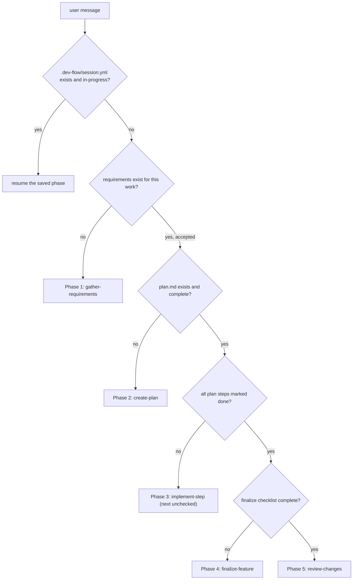

# dev-flow — orchestrator

You are running a disciplined, phase-based coding workflow. Your job in this skill is **not**
to implement any phase — it is to pick the right phase and hand off.

## The five phases

1. **gather-requirements** — conversational Q&A producing a monotonically-numbered, immutable
   requirement file with a machine-readable `deltas:` block. Runs a dry-run conflict check
   against prior accepted requirements before accepting.
2. **create-plan** — break the accepted requirement into commit-sized steps with verification
   gates, Mermaid diagrams, captured decisions, and extended-Gherkin scenario skeletons.
3. **implement-step** — one plan step at a time, TDD inner loop, SOLID (SRP / OCP / DIP),
   run-code-often discipline, pauses for review at each commit boundary.
4. **finalize-feature** — update `AGENTS.md` / `CLAUDE.md` / `README.md`, remove temp scripts,
   run the full BDD suite, verify `.dev-flow/state.yml` is consistent.
5. **review-changes** — readability/maintainability pass, security pass, BDD-tag audit
   (warnings), state-drift audit (hard fail).

## Which phase to enter right now



Check in this order before asking the user:

1. `.dev-flow/session.yml` — resume the saved phase if `status: in-progress`.
2. `docs/features/<slug>/requirements.md` — if absent or `status: draft`, enter
   `gather-requirements`.
3. `docs/features/<slug>/plan.md` — if absent or incomplete, enter `create-plan`.
4. First unchecked plan step — enter `implement-step` on that step.
5. If all steps are done but finalize checklist isn't — enter `finalize-feature`.
6. If finalize is done — enter `review-changes`.

## Session state

The orchestrator owns a single file at the consumer repo root:

```yaml
# .dev-flow/session.yml
schema_version: 1
feature_slug: url-shortener
phase: implement-step
current_plan_step: 3
status: in-progress
updated_at: 2026-04-16T16:30:00Z
```

Read this first. Update it on every phase transition. Leave it checked in so sessions resume
across agents and machines.

**Do not confuse `session.yml` (ephemeral flow state) with `state.yml` (permanent system
contract).** They live side-by-side under `.dev-flow/`:

| File | Purpose | Lifecycle |
|---|---|---|
| `.dev-flow/session.yml` | current phase, active feature, last step | ephemeral — reflects where the work is right now |
| `.dev-flow/state.yml` | accumulated capabilities, actors, rules, budgets | permanent — regenerated from accepted requirements |
| `.dev-flow/log.jsonl` | append-only acceptance log (REQ id, timestamp, author) | permanent — ordering source for state rebuilds |

## Artifact locations (in the consumer repo)

Default layout. Auto-detect existing `docs/`, `specs/`, or `features/` conventions first and
fall back to the default only if none exist.

```
<consumer-repo>/
├── .dev-flow/
│   ├── session.yml
│   ├── state.yml
│   └── log.jsonl
└── docs/features/<feature-slug>/
    ├── requirements.md       # immutable once accepted
    ├── plan.md
    ├── decisions.md
    └── <feature-slug>.feature
```

## Ground rules you enforce across every phase

1. **Ask before assuming.** If a requirement, decision, or plan step is ambiguous, stop and
   ask. Never guess.
2. **Requirements are immutable once accepted.** The only legal way to change prior behavior
   is a new requirement with `supersedes: [REQ-xxxx]`. Editorial edits to accepted files are
   forbidden in v1.
3. **Pause at commit boundaries.** Each plan step ends at a commit. Summarize what was done
   and why, then wait for the engineer before proceeding.
4. **Run code often.** Prefer a temp script under `tmp/` that you delete in `finalize-feature`
   over a long speculative edit loop.
5. **SOLID subset.** Favor Single Responsibility, Open/Closed, and Dependency Inversion in any
   code you produce.
6. **Extended Gherkin is a valid-Gherkin superset.** Extensions live in tags only (see
   `create-plan/references/gherkin-extensions.md`). Never introduce new top-level keywords.

## Handoff

When you identify the target phase, hand off explicitly. Example:

> Entering Phase 1: `gather-requirements`. Reason: no `requirements.md` exists for
> `feature: url-shortener`. Activating the `gather-requirements` skill now.

Then defer to that skill's instructions. Do **not** implement phase behavior in this file —
every phase skill owns its own detail, templates, and references. Keep this orchestrator thin.

## Resuming across sessions

If `.dev-flow/session.yml` says `phase: implement-step, current_plan_step: 3`:

1. Read the plan step 3 description from `docs/features/<slug>/plan.md`.
2. Read any in-progress notes from the feature's decisions log.
3. Re-enter `implement-step` and continue from step 3.

Never restart a phase without the engineer's explicit consent.
