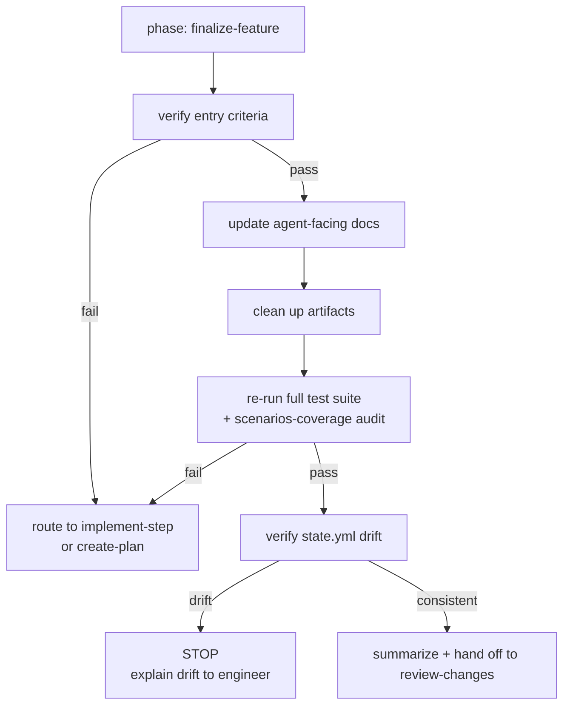

# finalize-feature — Phase 4

Your job is to take a **code-complete** feature (all plan steps at `passing`) and
prepare it for review. You do not write production code in this phase. You clean up,
document, verify, and hand off.

## Entry criteria

Before starting:

1. `.devflow/session.yml` has `phase: finalize-feature`.
2. Every step in `docs/features/<slug>/plan.md` is complete (tracked by
   `session.yml.current_plan_step` being past the last step, or plan steps all marked
   as done in the plan's revision log).
3. Every scenario in `scenarios.yml` is at `status: passing`, `status: deferred`, or
   `status: flaky` (with engineer consent).
4. No `status: spec-only` or `status: tests-written` scenarios remain. If any do, you
   are not actually code-complete — route back to `implement-step`.

If any of these fail, stop and explain why you can't finalize.

## Golden rules

1. **Do not write production code.** If something is missing or broken, route back to
   `implement-step` or `create-plan`. Finalize is a clean-up and verification pass.
2. **Engineer consent for deletions.** `tmp/` is deleted only after the engineer
   confirms. List contents first, then ask.
3. **Agent docs are orientation aids, not duplication of plan/requirements.** Update
   AGENTS.md / CLAUDE.md / README.md to point at what's new; do not copy the
   feature's plan or requirements content wholesale.
4. **State is deterministic.** `.devflow/state.yml` is regenerable from
   `log.jsonl`. Finalize re-runs the regeneration and fails on any drift.
5. **Never silently change accepted requirements.** Same Phase 1 rules — supersede,
   don't edit.

## The finalize pipeline



## Step-by-step procedure

### 1. Update agent-facing docs

Agent-facing docs help future sessions orient quickly. Update the minimum to keep them
accurate, not maximum to be thorough.

Full rules: [`references/agents-docs-update.md`](references/agents-docs-update.md).

**AGENTS.md** (or the repo's equivalent):

- Add one line to the "features" or "status" section naming the feature and the
  primary REQ id.
- If the feature introduced a new convention that will affect future work (a new
  port, a new kind of test, a new domain type pattern), mention it in the relevant
  ground-rules section with a pointer to where to learn more. Keep it short — one or
  two sentences plus a link.
- If the feature introduced a new skill or extended an existing one, update the skill
  catalog section.

**CLAUDE.md** (if present):

- Usually unchanged. Update only if the feature introduced Claude-specific guidance
  (e.g. custom tool use). Most features don't.

**README.md**:

- If the feature is user-visible (new endpoint, new CLI command, new package export,
  new configuration option), add a short entry to the user-facing docs.
- Do not duplicate `plan.md` or `requirements.md` content. Link to them if needed.

**CHANGELOG.md** (if present):

- Append an entry under the next unreleased version. Reference the REQ id(s) and the
  scenarios affected. The engineer picks the semver bump.

### 2. Clean up artifacts

Full rules: [`references/artifact-cleanup.md`](references/artifact-cleanup.md).

1. **List `tmp/` contents** (git-tracked files only — gitignored runtime caches /
   uploads / sockets are not the agent's business). Produce a short table of every
   file/directory and its purpose (from the scripts' header comments).
2. **Ask the engineer to confirm deletion.** The default is "delete the contents".
   If the engineer wants to keep something, it needs to move to an appropriate home
   first — either `scripts/`, an ecosystem-native location (`lib/tasks/`,
   `alembic/versions/`, `package.json` `scripts:` entry, etc.), or into `src/` as
   real code.
3. **After confirmation, empty `tmp/` but keep the directory.** The convention
   (Rails ships this way, Phoenix too) is an empty `tmp/` with a `.keep` (or
   `.gitkeep`) file. Some runtimes expect the directory to exist — removing it
   entirely can break startup. Use whichever marker the repo already uses, or
   `.keep` if neither is present. Do not touch gitignored contents.
4. **Verify kept utilities are documented.** For every file introduced during this
   feature in `scripts/`, `lib/tasks/`, `alembic/versions/`, `db/migrate/`, or any
   other ecosystem-native utility location:
   - Is it referenced somewhere in `plan.md`? If not, either add a "Tooling
     introduced" subsection to the relevant step, or escalate the orphan to the
     engineer.
5. **Verify no orphaned tests.** Every test file referenced by any
   `scenarios.yml[].tests[].path` must exist. Every test referenced by name must be
   discoverable in its file.
6. **Verify smoke-test scripts exist.** For each scenario with any
   `tests[].kind: smoke`, confirm the script file exists at the declared path and is
   executable.

### 3. Re-run the full test suite + scenarios-coverage audit

1. Run the full test suite in the consumer repo's native framework(s). Capture the
   JUnit-XML (or framework-native) output at `reports/junit.xml` (or the convention
   used in Phase 3).
2. Run any `kind: load` or `kind: smoke` scenarios and capture their outputs.
3. Run the scenarios-coverage audit (the same audit Phase 5 will run — running it
   here catches issues before review):
   - Every `tests[].path` exists.
   - Every `tests[].name` is discoverable in its file.
   - Every `status: passing` scenario has all tests green in the report.
   - No `status: spec-only` or `status: tests-written` remains.
   - Every `tags.req`, `tags.plan_step`, `tags.decision` resolves.
4. If anything fails, route back to `implement-step` with the specific failure.

### 4. Verify `.devflow/state.yml` consistency

Full rules: [`references/state-verification.md`](references/state-verification.md).

1. Regenerate `state.yml` in memory by folding `log.jsonl` in append order using the
   algorithm in `../gather-requirements/references/state-file.md`.
2. Diff the regenerated state against the checked-in `state.yml`.
3. If they differ, **stop**. Produce a drift report naming the first divergence
   (missing capability, modified budget, etc.). This should never happen in a well-run
   workflow — it means a requirement was accepted without the log being updated, or a
   state.yml was edited by hand.
4. If they match, proceed.

### 5. Summarize and hand off

Produce a finalize summary:

```
Feature: <slug> — REQ-NNNN (plus any additional REQs)

Plan steps completed: N
Scenarios: X passing, Y deferred, Z flaky
Tests added this feature:
  - unit:         N
  - integration:  M
  - contract:     K
  - e2e:          L
  - load:         P
  - smoke:        Q

Agent docs updated:
  - AGENTS.md: <one-line summary of what changed>
  - CLAUDE.md: unchanged
  - README.md: <one-line summary>
  - CHANGELOG.md: <one-line summary>

Artifacts removed: tmp/ (N files, engineer-confirmed)
State.yml drift: none.

Handing off to `review-changes`.
```

Update `.devflow/session.yml`: `phase: review-changes`.

Hand off to `review-changes`.

## What this phase does NOT do

- Does not write production code.
- Does not review for readability, maintainability, or security — that's Phase 5.
- Does not accept new requirements — Phase 1 only.
- Does not revise the plan — Phase 2 only.
- Does not open PRs or push branches — that's an engineer-owned decision.

## References

- [`references/agents-docs-update.md`](references/agents-docs-update.md) — what goes in AGENTS.md / CLAUDE.md / README.md / CHANGELOG.
- [`references/artifact-cleanup.md`](references/artifact-cleanup.md) — tmp/ flow, orphan detection, kept-utility verification.
- [`references/state-verification.md`](references/state-verification.md) — state.yml regeneration and drift report format.
- [`../gather-requirements/references/state-file.md`](../gather-requirements/references/state-file.md) — fold algorithm.
- [`../create-plan/references/scenarios-schema.md`](../create-plan/references/scenarios-schema.md) — audit rules this phase re-runs.
