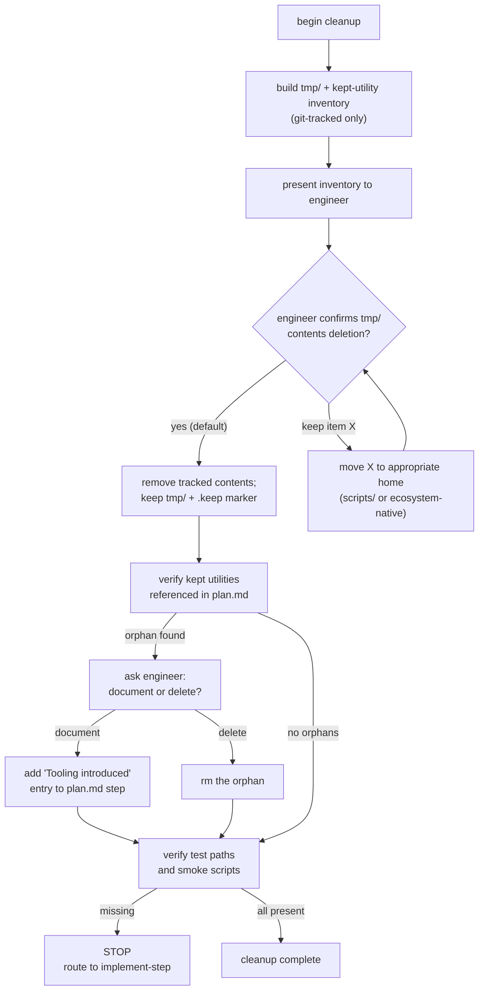

# Artifact cleanup

The finalize pass removes temporary artifacts and verifies that kept utilities are
documented. The contract was set in Phase 3
([`../../implement-step/references/run-discipline.md`](../../implement-step/references/run-discipline.md));
this file describes the cleanup procedure.

## Pre-flight: inventory

Before deleting anything, produce an inventory. The engineer reviews it before
confirming.

### `tmp/` inventory

Scope: **git-tracked files under `tmp/` only**. Gitignored contents (runtime caches,
uploaded files, sockets, pids, framework-managed scratch) are explicitly out of scope
— do not list or touch them. In practice this means you run something equivalent to
`git ls-files tmp/` rather than `find tmp/`.

For each tracked file under `tmp/`:

| Path | Size | Purpose (from header comment) |
|---|---|---|
| `tmp/probe-shorten.js` | 420 B | Probe for scenario: valid-https-returns-201 (step 3) |
| `tmp/load-capture.txt` | 12 KB | autocannon output captured during step 7 |
| `tmp/notes.md` | 2.1 KB | Ad-hoc notes from step 4 |

If a file has no header comment describing its purpose, flag it. Ask the engineer what
to do with it before assuming it's safe to delete.

### Kept-utility inventory

List every file **introduced during this feature** in:

- `scripts/` (generic fallback location)
- Ecosystem-native utility homes:
  - Ruby: `lib/tasks/*.rake`, `db/migrate/*.rb`
  - Python: `alembic/versions/*.py`, `<app>/migrations/*.py`, `<app>/management/commands/*.py`
  - Node: new `package.json` `scripts:` entries, `bin/*`, `prisma/migrations/`, `migrations/` (Knex), `src/migrations/` (TypeORM)
  - Go: `cmd/<name>/main.go`
  - Rust: `src/bin/*.rs`
  - Elixir: `lib/mix/tasks/*.ex`, `priv/repo/migrations/*.exs`
  - Java: Flyway `src/main/resources/db/migration/`, EF Core `Migrations/`

Compute "introduced during this feature" by taking `git log --diff-filter=A --name-only <feature-base>..HEAD` (or equivalent) filtered to these paths. If git isn't available, ask the engineer.

## Flow



## Detailed rules

### `tmp/` deletion

**Default:** remove the tracked contents; leave the directory in place with a `.keep`
(or `.gitkeep`) marker.

**Why keep the directory?** Multiple frameworks (Rails, Phoenix, and any process that
writes to `tmp/` without `mkdir -p`) expect `tmp/` to exist at startup. Removing it
can surface as mysterious "no such file or directory" errors later. The checked-in
empty-directory-with-marker convention sidesteps this.

**Marker choice:** use whichever file the repo already uses — `.keep`, `.gitkeep`, or
nothing if the repo tolerates bare empty dirs (some frameworks create `tmp/` on
startup themselves). If no existing convention, default to `.keep`.

**Procedure:**

1. `git ls-files tmp/` to get the tracked file list (scoped to what the agent owns —
   not gitignored runtime content).
2. For each tracked file **that the engineer opted to keep**, move it to an
   appropriate home:
   - Utility (seed, migration, smoke check) → ecosystem-native location or `scripts/`,
     and document in `plan.md` under the relevant step.
   - Notes → `docs/features/<slug>/notes.md` or equivalent.
   - Load-capture / probe output worth retaining for audit →
     `docs/features/<slug>/artifacts/` with a reference from the step's verification
     block.
3. For every remaining tracked file, `git rm` it.
4. Ensure the marker file exists (`tmp/.keep` or whatever the repo uses). If the
   marker was already present, leave it alone.
5. **Do not** `rm -rf tmp/`. Do not touch gitignored entries.

### Orphan detection

An "orphan" is a utility file that was introduced during this feature but is **not
referenced** anywhere in `plan.md`. Orphans are a signal that either:

- The utility was useful but we forgot to document it — add a "Tooling introduced"
  entry to the step that created it.
- The utility was a dead end — delete it.
- The utility was introduced in an earlier feature but only touched during this one —
  that's fine, not an orphan.

The check is heuristic: does `plan.md` (or any revision of it) mention the file by
name or reference its containing directory with purpose? If yes, not an orphan.

### Test path and smoke script verification

For every scenario in `scenarios.yml`:

1. For each `tests[].path`, confirm the file exists on disk.
2. For each `tests[].name`, confirm discoverable in the file using the framework's
   discovery command (see
   [`../../implement-step/references/test-framework-adapters.md`](../../implement-step/references/test-framework-adapters.md)).
3. For each `tests[].kind: smoke`, confirm the referenced script file exists and is
   executable (`chmod +x` or equivalent).

Any failure routes back to `implement-step` with the specific missing path or name.
Do not attempt to fix by editing tests here — that's Phase 3's job.

## Output

After cleanup, produce a one-block summary to include in the finalize hand-off:

```
Artifacts removed:
  tmp/ — 7 tracked files, 48 KB (engineer-confirmed; directory retained with tmp/.keep)

Kept utilities added this feature:
  - scripts/smoke/shortener.sh (referenced by scenario redirect-known-code-302)
  - alembic/versions/20260416_add_shortening_table.py (step 6)
  - package.json scripts.migrate (step 6)

Orphans resolved:
  - none
```

## When cleanup routes back to implement-step

If any of these are true, do not proceed to the test-suite re-run:

- A `tests[].path` doesn't exist.
- A `tests[].name` isn't discoverable.
- A `kind: smoke` script is referenced but missing or not executable.
- A `status: passing` scenario's `tests:` list is empty.

Stop, produce a short report, and route back. The engineer can resume in Phase 3
against the affected scenario.
