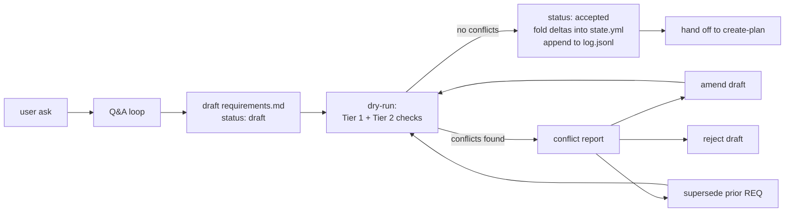

# gather-requirements — Phase 1

Your job is to turn a fuzzy ask into an **accepted, immutable requirement** that the rest of
the workflow can rely on. Requirements are treated like database migrations: monotonically
numbered, immutable once accepted, supersede-only.

## Golden rules

1. **Ask before assuming.** When anything is ambiguous, stop and ask — one or two focused
   questions at a time, not a wall of bullets.
2. **Accepted requirements are immutable.** Never edit `status: accepted` files in place. Any
   change in intent requires a **new** requirement file with `supersedes: [REQ-xxxx]`.
3. **No code in this phase.** Only artifacts: the requirement file and updates to
   `.dev-flow/state.yml` / `.dev-flow/log.jsonl`.
4. **Conflict before accept.** Every draft runs through the dry-run before acceptance. See
   [`references/conflict-detection.md`](references/conflict-detection.md).

## The lifecycle



Every draft must pass dry-run before it can be accepted. Never hand-edit `state.yml` — it is
deterministically regenerated from the ordered acceptance log.

## What to do, step by step

### 1. Establish the feature slug

Before the Q&A, agree on a short kebab-case slug (`url-shortener`, `password-reset`,
`rate-limits`). This drives the directory path: `docs/features/<slug>/`.

If a `docs/features/<slug>/` already exists with accepted requirements, you are authoring an
**amending or superseding** requirement. Read the existing files first before asking anything.

### 2. Run the Q&A loop

Work through the [`references/question-bank.md`](references/question-bank.md) categories in
this order, skipping categories that are clearly settled:

1. **Context** — why now, what problem, who's affected.
2. **Actors** — who interacts with this, what roles exist.
3. **Functional** — observable behaviors; stated as "the system shall…".
4. **Non-functional** — performance budgets, security constraints, compliance.
5. **Edge cases** — failure modes, abuse paths, empty/degenerate states.
6. **Out-of-scope** — explicitly what this requirement does **not** cover.
7. **Acceptance criteria** — testable, one-liner per criterion, will map 1:1 to BDD
   scenarios later.

Ask one or two questions at a time. Summarize back after each cluster to check alignment.
**Never invent answers**; if the engineer doesn't know, record it under *Open Questions*.

### 3. Allocate the monotonic ID

Look in `docs/features/*/requirements.md` (or wherever the repo stores them — auto-detect as
per orchestrator rules) for the highest `id:` in YAML frontmatter. The next ID is that number
+ 1, zero-padded to 4 digits (`REQ-0042`). IDs are **global across features**, not per-feature
— this matters because conflicts cross feature boundaries.

### 4. Fill the template

Copy [`references/requirements-template.md`](references/requirements-template.md) to
`docs/features/<slug>/requirements.md`. Fill every section. Set `status: draft`.

The template ends with a machine-readable `deltas:` YAML block. See
[`references/state-file.md`](references/state-file.md) for the exact schema. This is
load-bearing — the dry-run reads these deltas.

### 5. Run the dry-run

Follow [`references/conflict-detection.md`](references/conflict-detection.md) to execute:

- **Tier 1 (structural):** dangling refs, duplicate IDs, touching `locked: true` scenarios,
  duplicate acceptance-criterion slugs with different outcomes.
- **Tier 2 (declarative state):** apply the `deltas:` block to a copy of `.dev-flow/state.yml`
  and check for capability/actor/rule consistency + numeric/enum budget contradictions.

If either tier fails, generate a **conflict report** per
[`references/supersede-protocol.md`](references/supersede-protocol.md) and **stop**. Present
it to the engineer with the three resolution paths.

### 6. Resolve or accept

- **Amend draft** — fix the draft, re-run dry-run.
- **Supersede prior** — add the conflicting prior IDs to `supersedes:` (with justification in
  *Decision Notes* of the new draft), re-run dry-run. The prior requirements stay on disk as
  history; they are now `status: superseded` and `superseded_by: REQ-xxxx`.
- **Reject draft** — user decides not to proceed. Keep the draft file with `status: rejected`
  and a note, or delete it (user's call).

If dry-run passes:

1. Flip the draft's frontmatter `status: draft` → `status: accepted`.
2. Apply the `deltas:` to `.dev-flow/state.yml` (see
   [`references/state-file.md`](references/state-file.md)). Commit the regenerated file.
3. Append a line to `.dev-flow/log.jsonl`:
   ```json
   {"id":"REQ-0042","accepted_at":"2026-04-16T16:45:00Z","feature":"url-shortener","supersedes":[]}
   ```
4. Update `.dev-flow/session.yml`: `phase: create-plan`.
5. Hand off to the `create-plan` skill with a one-line summary.

## Handoff format

When done, say exactly:

> Requirement **REQ-0042** (`url-shortener`) accepted. State file updated (+3 capabilities,
> 1 budget). No conflicts. Handing off to `create-plan` for step breakdown.

Then stop. Do **not** start planning in this skill — that's Phase 2.

## When a superseding requirement is needed

If during the Q&A the engineer says something that contradicts an accepted requirement, do
**not** silently override it. Say:

> "That conflicts with REQ-0017 (accepted 2026-03-02) which says X. We can either: (a) keep
> REQ-0017 as-is and narrow the new requirement to not conflict, or (b) supersede REQ-0017
> with a new requirement that replaces it. Which do you want?"

If (b), the new requirement's frontmatter carries `supersedes: [REQ-0017]` and its *Decision
Notes* section explains why. The dry-run will still run and may surface *further* conflicts
(because REQ-0017 may itself have been depended on by REQ-0023).

## What this skill does NOT do

- Produce plans, BDD scenarios, or code — those are later phases.
- Edit accepted requirement files.
- Mutate `.dev-flow/state.yml` by hand (always regenerate from the log).
- Skip the dry-run.

## References

- [`references/question-bank.md`](references/question-bank.md) — the canonical question sets.
- [`references/requirements-template.md`](references/requirements-template.md) — copy-paste template.
- [`references/state-file.md`](references/state-file.md) — `state.yml` schema + delta semantics.
- [`references/conflict-detection.md`](references/conflict-detection.md) — Tier 1 + Tier 2 algorithm.
- [`references/supersede-protocol.md`](references/supersede-protocol.md) — immutability rule + conflict report format.
