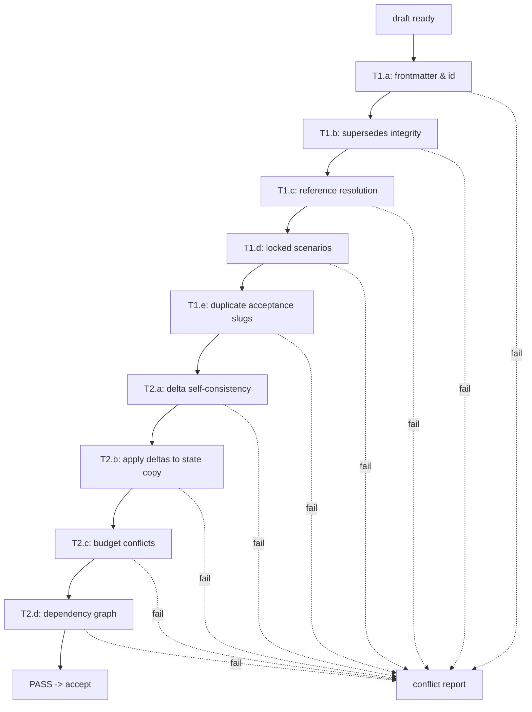

# Conflict detection (dry-run)

Run this algorithm on every draft before acceptance. It performs **Tier 1** (structural) and
**Tier 2** (declarative state) checks. On any failure, emit a conflict report per
[`supersede-protocol.md`](supersede-protocol.md) and stop.

Tiers 3 (LLM semantic) and 4 (BDD regression) are **not** in v1.

## Inputs

- The draft requirement file (`status: draft`) with its `deltas:` block.
- `.dev-flow/state.yml` (current accumulated contract).
- `.dev-flow/log.jsonl` (ordered acceptance log).
- All accepted requirement files (reachable via the log).
- All `scenarios.yml` files in the repo (for `locked: true` scenario checks).

## Algorithm



Run all checks even after the first failure — a single conflict report that lists every issue
is more useful than one issue at a time.

## Tier 1 — structural checks

### T1.a — frontmatter + id

- `id:` matches the `REQ-NNNN` pattern (zero-padded, monotonic).
- `id:` is greater than every id already in `log.jsonl`.
- `id:` is not already present in any file on disk (no reuse).
- `feature:` matches the directory slug (`docs/features/<feature>/requirements.md`).
- `status:` is `draft`.
- `supersedes:` in frontmatter equals `supersedes:` in the deltas block.

### T1.b — supersedes integrity

For each id in `supersedes:`:

- The referenced REQ exists on disk.
- Its current `status:` is `accepted` (cannot supersede something already superseded or
  rejected).
- It is not in the draft's own id history (no self-supersede cycles).

### T1.c — reference resolution

Scan the draft's *Functional*, *Acceptance criteria*, and *Decision notes* sections for
references like `REQ-XXXX`, `DEC-XXXX`, or capability/actor/rule ids:

- Every `REQ-XXXX` reference resolves to an existing file.
- Every capability/actor/rule id mentioned in the prose **also appears** in the deltas block
  (either `adds`, `modifies`, or transitively via the current `state.yml`). Otherwise the
  prose and deltas are out of sync.

### T1.d — locked scenarios

For each existing `scenarios.yml` file in the repo, load scenario entries with
`locked: true`.

- If the draft `supersedes:` a REQ whose acceptance criteria are referenced by a locked
  scenario (via `tags.req: [REQ-XXXX]`), the supersede is a **conflict**. The engineer
  must either unlock the scenario via a new `gather-requirements` pass or narrow the
  draft.

### T1.e — duplicate acceptance-criterion slugs

Each acceptance criterion has an implicit slug derived from its text (e.g. first 6 words
kebab-cased). If the draft's acceptance criteria produce a slug that collides with any
`tags.req: [REQ-XXXX]` link on a scenario in another feature — flag as a likely
duplicated criterion. This is heuristic (warning-level inside Tier 1), not a hard
failure.

## Tier 2 — declarative state checks

### T2.a — delta self-consistency

- `adds` items do not share ids with each other.
- `modifies` items' `from:` values are provided and parseable.
- `removes` items do not also appear in `modifies` or `adds`.
- Every `modifies.budgets[].from:` and `to:` normalize to the same unit family (e.g.
  `ms ↔ s` is fine; `ms ↔ percent` is a hard failure).

### T2.b — apply deltas to a state copy

Fold `draft.deltas` into a copy of `state.yml` using the algorithm in
[`state-file.md`](state-file.md#fold-algorithm-how-stateyml-is-regenerated):

- `adds` must not collide with any existing id in the state copy.
- `modifies.*.from:` must match the current value in the state copy (proves the draft was
  written against an up-to-date snapshot).
- `removes` must reference ids that exist.
- No capability may reference a removed actor. No budget may reference a removed capability.

Any failure here is a hard conflict. Include the exact id and the mismatching values in the
report.

### T2.c — budget conflicts (the big one)

For each budget in `adds` or `modifies`:

- If its id already exists in state and is not being modified, compare values. A numeric
  tightening (e.g. `p95 < 200ms` to `p95 < 100ms`) in a different REQ is a conflict unless
  this REQ is superseding that one.
- If two different REQs in the acceptance log have non-superseded budgets with the same id
  but different values, this indicates a missed conflict — flag and require user resolution.
- Values must lie within any **global** budget for the same dimension (e.g. a per-endpoint
  latency budget must be ≤ the application-wide SLO budget if one exists).

### T2.d — dependency graph

After applying the draft's deltas, walk the resulting state:

- Every `capability.actors[]` id resolves to an existing actor.
- Every `budget` / `rule` id whose prefix names a capability namespace has a corresponding
  capability in state (e.g. `url-shortener.redirect.latency-p95` requires `url-shortener.redirect`).
- If the draft `removes` an actor still referenced by any non-superseded capability, that's
  a conflict.

## Conflict report

On any hard failure (from either tier), emit a report in this format and **stop**:

```
CONFLICT REPORT for REQ-0042 (feature: url-shortener)

Tier 1 failures (2):
  T1.b supersedes integrity:
    REQ-0017 in `supersedes:` has status=superseded, superseded_by=REQ-0031.
    Cannot supersede something already superseded. Fix: target REQ-0031 instead.

  T1.d locked scenarios:
    docs/features/auth/scenarios.yml has locked: true on id=valid-login
    (tags.req: [REQ-0017]). Superseding REQ-0017 would invalidate a locked
    scenario.

Tier 2 failures (1):
  T2.c budget conflict:
    budget 'url-shortener.redirect.latency-p95' exists with value=200ms (from REQ-0031).
    Draft writes value=100ms without superseding REQ-0031.
    Fix: add REQ-0031 to 'supersedes:' OR choose a non-conflicting value.

Resolution paths:
  (a) amend the draft to address the issues above
  (b) supersede the prior REQs listed: [REQ-0031]
  (c) reject the draft (set status: rejected and stop)
```

Present this report verbatim to the engineer, ask which resolution path to take, and re-run
the dry-run after changes. Do not attempt to auto-fix.

## What the dry-run does NOT check

- Natural-language contradictions ("posts are permanent" vs "users can delete posts") —
  that's Tier 3, deferred.
- Whether the implementation would regress existing passing scenarios — that's Tier 4,
  deferred.
- Whether the requirement is a good idea — that's human judgment, always.
