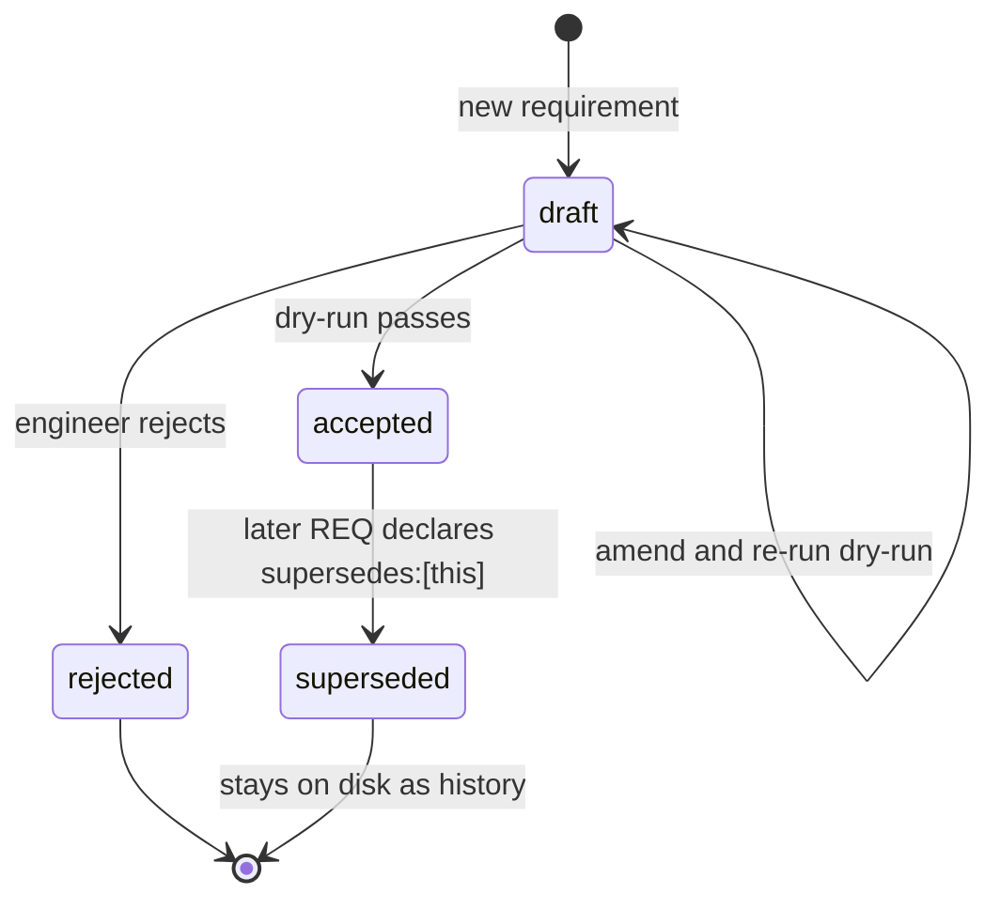

# Supersede protocol

Accepted requirements are **immutable** in v1. The only legal way to change prior behavior is
a new requirement that explicitly declares `supersedes: [REQ-xxxx]`.

This file codifies the rule, the conflict report format, and the three resolution paths.

## Why strict supersede-only

Migrations-for-requirements only works if the acceptance log is a linear history of intent.
Once you allow in-place edits, you lose:

- **Determinism.** `state.yml` can no longer be rebuilt from the log.
- **Traceability.** Scenarios linked via `tags.req: [REQ-0017]` would silently mean something
  different depending on when you read them.
- **Conflict detection.** Tier 1 reference resolution stops meaning anything if the target
  can shift under you.

The cost is that **typos require a new REQ**, which feels heavy. That's a deliberate v1 trade
— editorial amendments are explicitly out of scope. If it hurts in practice, we'll revisit.

## The rule

Once a requirement's frontmatter has `status: accepted`:

- Its prose body is frozen. Do not edit it.
- Its `deltas:` block is frozen. Do not edit it.
- Its frontmatter is frozen **except for these two fields**, which are set by tooling when a
  later REQ supersedes it:
  - `status:` may change `accepted` → `superseded`
  - `superseded_by:` may change `null` → `REQ-xxxx`

Any other edit to an accepted requirement file is a **state-drift violation** and will be
caught by the `review-changes` audit.

## The three resolution paths

When the dry-run produces a conflict report, the engineer picks one:

### (a) Amend the draft

Fix the draft so it no longer conflicts. Examples:

- Loosen a budget so it doesn't tighten a prior one.
- Rename an id to avoid collision.
- Narrow scope so a `locked: true` scenario is no longer invalidated.

Edit the draft, re-run the dry-run. The draft is still `status: draft` — nothing has been
accepted yet.

### (b) Supersede the prior REQ(s)

Accept that the new draft replaces prior behavior. Add the conflicting REQ ids to both:

- Frontmatter `supersedes: [REQ-0017, REQ-0031]`
- Deltas block `supersedes: [REQ-0017, REQ-0031]` (must match exactly)

Then fill the **Supersedes** section of the draft with:

- Which prior REQs are being replaced.
- What changes and why (link to decisions.md if useful).
- Any downstream impact (BDD scenarios that need updating, dependent REQs).

Re-run the dry-run. It may surface *new* conflicts (the superseded REQ may itself have been
depended on by something).

### (c) Reject the draft

The engineer decides not to proceed. Two options:

- Set the draft's `status: rejected`, fill a one-line reason in a `## Rejected` section, and
  commit the file as history.
- Delete the draft entirely. No audit trail, but no clutter.

Either is fine. The rejected file does **not** append to `log.jsonl`.

## Conflict report format

Emitted by the dry-run. Reproduced here for reference — see
[`conflict-detection.md`](conflict-detection.md#conflict-report) for the generator.

```
CONFLICT REPORT for REQ-<new-id> (feature: <slug>)

Tier 1 failures (<count>):
  T1.<letter> <check name>:
    <specific finding with ids and values>
    Fix: <concrete suggestion>

Tier 2 failures (<count>):
  T2.<letter> <check name>:
    <specific finding with ids and values>
    Fix: <concrete suggestion>

Resolution paths:
  (a) amend the draft to address the issues above
  (b) supersede the prior REQs listed: [REQ-xxxx, ...]
  (c) reject the draft (set status: rejected and stop)
```

Present the report verbatim to the engineer, then stop and wait for the choice. Never
auto-pick a path.

## Writing a superseding requirement

Authoring a supersede looks like authoring any other requirement, with these additions:

1. **Read the superseded REQ first.** Understand what it promised and who depends on it.
2. **Check `.devflow/log.jsonl`** for REQs that were accepted *after* the one being
   superseded. Their deltas may rely on behavior you're about to remove.
3. **Fill the Supersedes section** with a table or bullet list of changes:

   ```markdown
   ## Supersedes

   Supersedes **REQ-0017** (accepted 2026-03-02).

   | Change type | What | Why |
   |---|---|---|
   | modified budget | p95 latency 200ms → 100ms | upstream SLA tightened; see DEC-0009 |
   | removed actor | `legacy-admin` | replaced by RBAC in REQ-0034 |
   | removed capability | `auth.basic-login` | force-upgrading to SSO |

   Dependent REQs:
   - REQ-0023 (still valid; capability it depends on is preserved)
   - REQ-0031 (will need updating in a separate REQ; flagged as follow-up)
   ```

4. **Run the dry-run**. If downstream REQs are broken (T2.d dependency graph), expect a
   second round of conflicts that you may need to supersede in turn — or narrow this REQ.

## State transitions summary



Once in `superseded`, a REQ file is fully frozen. It is not deleted — it's history — and its
`deltas:` are no longer applied during state.yml regeneration (superseded REQs are skipped in
the fold).

## One thing the protocol does not cover

"Typos in accepted files" is not a resolution path. If there's a typo in an accepted
requirement's prose body, it lives on unless you supersede the whole REQ. That's painful by
design for v1; if it bites hard we'll add an editorial-amendments mechanism in a later
version.
