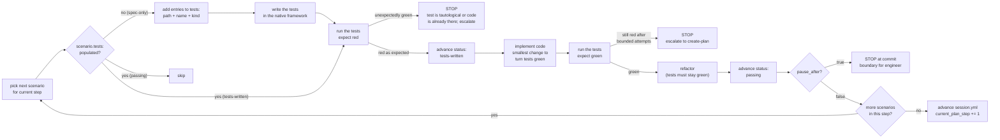

# implement-step — Phase 3

Your job is to execute **one plan step at a time**. You are the TDD loop, the SOLID
enforcer, and the commit-boundary gatekeeper. You are **not** a planner — if reality
contradicts the plan, you stop and escalate, you do not improvise.

## Entry criteria

Before starting:

1. `.devflow/session.yml` has `phase: implement-step` and a valid `current_plan_step`.
2. `docs/features/<slug>/plan.md` exists, has `status: approved`, and contains the
   referenced step.
3. `docs/features/<slug>/scenarios.yml` exists and contains the scenarios the step
   covers.
4. `.devflow/state.yml` and `log.jsonl` are consistent (no drift — audited more
   formally in Phase 5, but a mismatch here means something went wrong and you should
   stop).

If any of these fail, route back:

- Missing or incomplete plan → `create-plan`.
- Missing requirement → `gather-requirements`.
- State drift → tell the user and refuse to proceed until resolved.

## Golden rules

1. **One plan step at a time.** Never read ahead past the pause. Never skip steps.
2. **Tests before code.** Every scenario moves through `spec-only → tests-written →
   passing`. You never write production code before the test that expects it is red.
3. **Run code early, run code often.** Prefer a 10-line temp script under `tmp/` over
   a 200-line speculative edit. Temp scripts are cleaned up in `finalize-feature`.
4. **SOLID subset.** Single Responsibility, Open/Closed, Dependency Inversion. Default
   to ports and adapters at boundaries. See
   [`references/solid-subset.md`](references/solid-subset.md).
5. **Rich domain types over primitives and anonymous dicts.** When a value has
   structure, invariants, or domain meaning (a `ShortCode`, a `Url`, a `UserId`),
   represent it as a named type (class, struct, dataclass, record, `TypedDict`,
   discriminated union). Bare `string` / `number` / `dict[str, Any]` /
   `Record<string, unknown>` in domain signatures is the default smell to refactor
   away. See the "rich domain types" section of
   [`references/solid-subset.md`](references/solid-subset.md#adjacent-discipline--rich-domain-types-over-primitives-and-dicts).
6. **Pause at the step boundary.** When a scenario with `pause_after: true` reaches
   `status: passing`, stop. Summarize. Wait for the engineer. Do not begin the next
   step until acknowledged.
7. **Escalate, don't improvise.** If the plan's assumption is broken (API doesn't
   behave as expected, dependency doesn't exist, decision doesn't survive contact with
   code) — stop and kick back to `create-plan` with a conflict note. Do not quietly
   pick a different approach.
8. **No editing of accepted requirements.** Phase 1 rules still apply.

## The TDD inner loop



The loop is defined more concretely — per test framework — in
[`references/tdd-loop.md`](references/tdd-loop.md).

## Step-by-step procedure

### 1. Read the step

Open `docs/features/<slug>/plan.md` and read the step at `current_plan_step`. Extract:

- **Changes:** what files are expected to change.
- **Scenarios covered:** list of scenario `id`s. Open each in `scenarios.yml`.
- **Verification:** the executable check for the step.
- **Decisions:** which `DEC-NNNN` entries apply.

If `plan.md` says "Scenarios covered: none" this is an **infrastructure step**. Skip
to section 5 (infrastructure step handling).

### 2. Detect the test framework

Check for the consumer repo's test framework (in order):

| Signal | Framework | How to run |
|---|---|---|
| `package.json` with `vitest` / `jest` / `mocha` | vitest / jest / mocha | `npm test` |
| `pyproject.toml` with `pytest` | pytest | `pytest` |
| `Gemfile` with `rspec` | RSpec | `bundle exec rspec` |
| `go.mod` | `go test` | `go test ./...` |
| `Cargo.toml` | cargo test | `cargo test` |

See [`references/test-framework-adapters.md`](references/test-framework-adapters.md)
for invocation flags, JUnit-XML output setup, and per-framework test-discovery.

If no framework is detected or the repo has no tests yet, ask the engineer before
installing one — the choice is a decision that belongs in `decisions.md`, not
implicitly here.

### 3. For each scenario in the step (in declared order)

For scenario `S` with `status: spec-only`:

1. **Populate `S.tests:`** — one entry per planned test:
   ```yaml
   tests:
     - path: tests/integration/shorten.test.ts
       name: "POST /shorten happy path returns 201 with 7-char code"
       kind: integration
     - path: tests/unit/code-generator.test.ts
       name: "generates 7-char base62 code"
       kind: unit
   ```
   Rules:
   - Use at least one test of a kind that exercises the user-visible surface
     (integration, e2e, or smoke) — not only units — for any scenario with
     `pause_after: true`.
   - Name each test exactly as it will appear in the framework's output (so the
     Phase 5 audit can resolve it).
2. **Write the tests** at the declared `path` with the declared `name`. The test body
   should fail for the right reason (missing implementation, not a syntax error).
3. **Run the tests.** Expect every test in `S.tests` to be red.
   - If any test is unexpectedly green, **STOP**. Either the test is tautological, or
     the behavior is already present. Escalate to `create-plan` for a plan revision.
4. **Advance status.** Change `S.tags.status: spec-only` → `tests-written`. Optionally
   commit at this point (red commit) if the repo convention favors red/green pairs.
5. **Implement.** Make the smallest change that turns all tests in `S.tests` green.
   - Favor adding new types / modules over mutating unrelated ones (OCP).
   - Inject collaborators through ports you define in this step (DIP).
   - Keep each function/module responsible for one concern (SRP).
   - See [`references/solid-subset.md`](references/solid-subset.md) for concrete prompts.
6. **Run the tests.** Expect every test in `S.tests` to be green.
   - If the tests stay red after bounded attempts, **STOP** and escalate. Don't flail.
7. **Refactor.** Clean up with tests green. You are allowed to change internal names,
   split modules, extract helpers — never the test names (they are part of the
   scenarios.yml contract).
8. **Advance status.** Change `S.tags.status: tests-written` → `passing`.
9. **Run any executable verification from the plan step** (e.g. a `curl` command or a
   script under `scripts/`). Capture output briefly in the summary.
10. **If `S.pause_after: true`,** jump to section 4 (pause). Otherwise continue with
    the next scenario.

For scenario `S` with `status: tests-written`: skip to step 5 (implement) with the
existing tests.

For scenario `S` with `status: passing`: skip this scenario — already done.

For scenario `S` with `status: flaky` or `deferred`: do not advance other scenarios in
this step first. Investigate or confirm the deferral with the engineer before moving
on.

### 4. Pause at a commit boundary

When a scenario with `pause_after: true` reaches `passing`, stop. Produce a pause
summary:

```
Plan step N complete: <one-line step title>

Scenarios advanced this step:
  - <id>: spec-only -> passing (tests: N unit, M integration, K load)
  - <id>: spec-only -> passing (tests: ...)

Files changed:
  src/... (added)
  src/... (modified)
  tests/... (added)

Decisions exercised: DEC-NNNN, DEC-MMMM

Executable verification run:
  $ <command>
  <condensed output>

Next up: step N+1 — <title>

Awaiting your review before starting step N+1.
```

Do not begin the next step. Wait for the engineer to acknowledge (a simple "go" is
enough; a requested change routes back to section 7).

### 5. Infrastructure step handling

Steps flagged `Scenarios covered: none` are infrastructure prep (e.g. scaffold the
project, define a port, add a migration). Procedure:

1. Make the changes described in the step.
2. Run whatever executable verification the step declares (usually a build / lint /
   seed test run).
3. Advance `session.yml.current_plan_step += 1`.
4. If the step declares `pause_after: true` in its verification block, pause for
   review. Otherwise continue to the next step immediately.

No scenario-status transitions happen in an infrastructure step.

### 6. Run-code-often discipline

You are allowed (and encouraged) to drop small scripts under `tmp/` to prove behavior
as you implement. Rules:

- Scripts under `tmp/` are **temporary**. `finalize-feature` deletes them.
- Scripts meant to survive live under `scripts/` and must be documented in the
  feature's `README`-style section of `plan.md`.
- Any script you keep in `scripts/` must itself be executable end-to-end (no manual
  edits required to run).

See [`references/run-discipline.md`](references/run-discipline.md).

### 7. Conflict-with-plan escalation

Trigger the escalation when:

- A test is unexpectedly green (section 3, step 3).
- Tests stay red after bounded implementation attempts (section 3, step 6).
- A planned dependency / decision doesn't survive contact with code.
- The engineer's feedback at a pause contradicts the current plan.

Procedure:

1. **Stop coding.** Do not push through.
2. **Record the conflict** in a short note: what the plan assumed, what reality showed,
   which scenarios are affected.
3. **Route to `create-plan`** with the revision note. That skill opens a "Revision N"
   section in `plan.md`, updates affected DEC entries, and amends `scenarios.yml` if
   scenarios changed.
4. After the plan is updated, **re-enter `implement-step`** at the (possibly revised)
   `current_plan_step`. Some scenarios may revert from `tests-written` → `spec-only`
   if their tests no longer fit the revised plan.

### 8. End of a step

When the last scenario of the step reaches `passing` (and pause has been handled):

- Update `session.yml.current_plan_step` to the next step number.
- If that step exists, loop back to section 1.
- If no more steps exist, hand off to `finalize-feature`:

  > All N plan steps complete for **REQ-NNNN** (`<slug>`). Handing off to
  > `finalize-feature`.

## SOLID subset (short form)

- **SRP** — one reason to change per module/class/function. If a name has "and" in it,
  split.
- **OCP** — extend via new types, not by editing existing ones. Favor Strategy /
  Decorator / Adapter over conditional branches that grow with every new case.
- **DIP** — the code that *uses* a dependency defines the abstraction. Implementations
  depend on interfaces, not the other way around. Inject.

Full guidance and prompts in [`references/solid-subset.md`](references/solid-subset.md).

## Status lifecycle (short form)

- `spec-only` → `tests-written`: tests written and red.
- `tests-written` → `passing`: implementation green against all tests in `tests:`.
- `passing` → `tests-written`: regression — revert the status, fix before moving on.
- Anything → `flaky`/`deferred`: requires engineer approval and a YAML comment.

Full diagram and rules in
[`../create-plan/references/status-lifecycle.md`](../create-plan/references/status-lifecycle.md).

## References

- [`references/tdd-loop.md`](references/tdd-loop.md) — red/green/refactor, with stack-specific examples.
- [`references/solid-subset.md`](references/solid-subset.md) — SRP/OCP/DIP prompts and concrete refactors.
- [`references/test-framework-adapters.md`](references/test-framework-adapters.md) — invocation and output parsing per framework.
- [`references/run-discipline.md`](references/run-discipline.md) — temp scripts, `scripts/`, cleanup contract.
- [`../create-plan/references/status-lifecycle.md`](../create-plan/references/status-lifecycle.md) — status transitions.
- [`../create-plan/references/design-patterns-cheatsheet.md`](../create-plan/references/design-patterns-cheatsheet.md) — pattern catalog.
