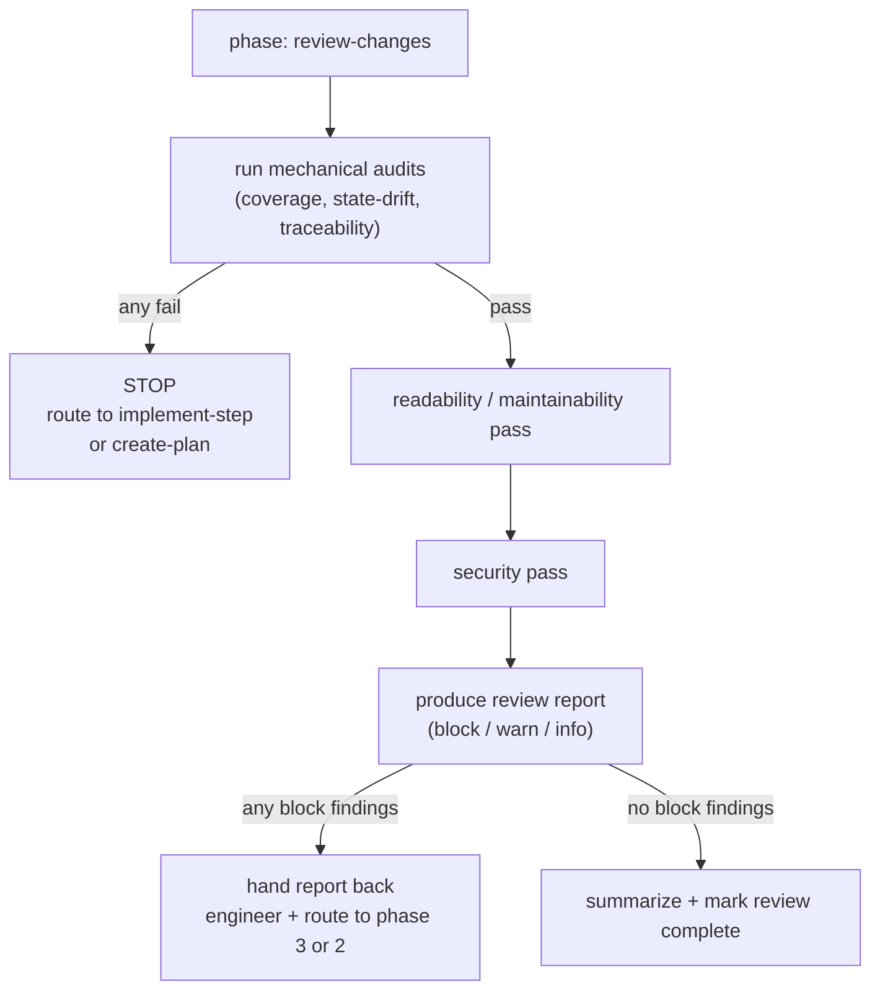

# review-changes — Phase 5

Your job is to **review**, not rewrite. You produce findings with evidence; the
engineer (or a route back to an earlier phase) applies the fixes. The audits are
mechanical and hard-block merge when they fail. The readability and security passes
are judgment calls tiered by severity.

## Entry criteria

Before starting:

1. `.devflow/session.yml` has `phase: review-changes`.
2. `finalize-feature` has run: `tmp/` is empty (marker retained), agent docs updated,
   test suite re-run clean, state drift zero.
3. Every scenario in `scenarios.yml` is `passing`, `deferred` (with a linked
   follow-up), or `flaky` (with engineer consent and a comment).

If any fail, route back:

- Code-complete but not finalized → `finalize-feature`.
- Scenarios incomplete → `implement-step`.

## Golden rules

1. **Review, don't rewrite.** You do not silently patch code or edit scenarios in
   response to findings. Produce the finding; route the fix to the appropriate phase.
2. **Evidence, always.** Every finding cites `file:line` (or `file` + `test name` for
   test findings) with the specific issue. No vague "consider improving X".
3. **Severity discipline.** Three tiers: **block** (merge-blocking), **warn**
   (should-fix-soon), **info** (advisory). Block is for correctness, security,
   contract violations — not stylistic preferences.
4. **Mechanical audits are non-negotiable.** Scenarios-coverage, state-drift, and
   traceability audits hard-block merge on failure. No "I'll fix it later".
5. **Security findings err toward block.** If you're unsure whether a security issue
   is severe enough to block, it probably blocks. The cost of a false-positive review
   round is low; the cost of shipping a real issue is high.

## The review pipeline



## Step-by-step procedure

### 1. Run the mechanical audits

These are hard gates. Any failure halts review and routes back.

- **Scenarios-coverage audit.** Every `tests[].path` resolves; every `tests[].name`
  is discoverable in the framework's output; every `status: passing` has all tests
  green in the latest CI report; no `status: spec-only` or `status: tests-written`
  remains.
- **State-drift audit.** `.devflow/state.yml` regenerated from `log.jsonl` matches
  the checked-in copy byte-for-byte after canonicalization.
- **Traceability audit.** Every `tags.req`, `tags.plan_step`, `tags.decision`
  resolves to an existing REQ / plan step / DEC. No superseded-REQ references on
  live scenarios. No `locked: true` scenario modified since its lock timestamp
  without a matching `gather-requirements` entry in the log.

Full rules: [`references/audit-machinery.md`](references/audit-machinery.md).

### 2. Readability and maintainability pass

Work through every file changed in this feature (use `git diff --name-only
<feature-base>..HEAD` or equivalent to scope). For each file check:

- **SOLID subset.** SRP / OCP / DIP. Cross-reference
  [`../implement-step/references/solid-subset.md`](../implement-step/references/solid-subset.md).
- **Rich domain types.** Bare `string`/`number` in domain signatures, anonymous
  dicts in cross-boundary types — all warn or block per the discipline in the SOLID
  reference.
- **Naming.** Does the name tell you what the thing does without reading the body?
- **Complexity.** Function/method length, cyclomatic complexity, nesting depth.
  Repo-specific thresholds if defined in `.devflow.yml`; otherwise heuristic.
- **Dead code.** Unused imports, unreferenced exports, commented-out code.
- **Test quality.** Tests that assert the right thing (not just "function was
  called"), no hidden shared fixtures that make tests order-dependent, no test
  names that don't match their assertions.
- **Documentation.** Non-obvious decisions have DEC entries. Public APIs have short
  doc comments. No obvious comments that just narrate code.

Full checklist and smells: [`references/readability-review.md`](references/readability-review.md).

### 3. Security pass

For every surface the feature exposes (HTTP endpoint, CLI command, queue consumer,
file parser, deserializer, etc.), check:

- **Authentication.** Does the surface check identity where required? Is unauth
  intended and documented?
- **Authorization.** Does the caller have permission for the resource? Row-level
  where applicable.
- **Input validation.** Every field validated for type, length, shape, invariants.
  Uses rich domain types at the boundary where possible.
- **Injection vectors.** SQL/NoSQL queries parameterized, shell invocations
  avoided or sanitized, HTML/JSON encoding correct for output context.
- **Secrets.** No secrets in code, config, or logs. Environment / secret manager
  only. Log redaction at the boundary.
- **SSRF / open-redirect / path traversal.** URLs, paths, and redirects validated.
  This is especially important for the URL-shortener sample (disallowed schemes
  are a first-class scenario for a reason).
- **Denial of service.** Rate-limits where appropriate; bounded input sizes;
  timeouts on external calls.
- **Dependencies.** New deps scanned against known-CVE lists (advisory only in v1;
  run whatever scanner the repo uses — `npm audit`, `pip-audit`, `cargo audit`,
  `bundle audit`).
- **Logging hygiene.** No PII/secrets in logs. Structured fields for auditability.

Full checklist and attack-surface prompts:
[`references/security-review.md`](references/security-review.md).

### 4. Produce the review report

One document, three severity tiers, grouped by category:

```markdown
# Review report — REQ-0042 (url-shortener)

Reviewer: <agent name / model / version>
Date: 2026-04-17T09:00Z
Feature base: <sha of feature branch point>

## Mechanical audits

- Scenarios-coverage: PASS
- State-drift:        PASS
- Traceability:       PASS

## Block findings (must fix before merge)

1. **[Security] SQL injection via `code` parameter**
   - File: `src/api/redirect.ts:23`
   - Evidence: `db.query("SELECT url FROM shortenings WHERE code='" + code + "'")`
   - Rationale: string concatenation into SQL. Fails input-validation and
     parameterization rule.
   - Resolution: route back to `implement-step` on scenario
     `redirect-known-code-302`; use parameterized query
     `db.query('SELECT url FROM shortenings WHERE code = $1', [code])`.

## Warn findings (should fix soon)

1. **[Readability] `ShortenerService` has two responsibilities (SRP)**
   - File: `src/domain/shortener.ts:12-60`
   - Evidence: the class both validates the URL and generates short codes.
   - Rationale: validation and generation will evolve independently; test
     arrangement already bifurcated (see `tests/unit/shortener.test.ts` groups).
   - Resolution: extract `UrlValidator` and `CodeGenerator` ports; inject.

## Info findings (advisory)

1. **[Naming] `utils.ts` is a catch-all file**
   - File: `src/utils.ts`
   - Note: consider splitting by concern in a follow-up.

## Deferred / flaky status review

- `redirect-perf-p95-150ms` is `deferred` — linked to REQ-0055 (future feature).
  OK to ship.

## Sign-off

Recommendation: BLOCK (1 block finding above).
```

Full report schema: [`references/review-report.md`](references/review-report.md).

### 5. Hand back or sign off

**If there are block findings:**

1. Update `.devflow/session.yml`: keep `phase: review-changes`, add
   `pending_findings: <path-to-report>`.
2. Tell the engineer: "Review has N block findings. See `<path>`. Route the fixes
   via `implement-step` (for code changes) or `create-plan` (for scenario/plan
   changes), then re-enter `review-changes`."
3. Do not silently fix.

**If there are only warn/info findings and no block:**

1. Update `.devflow/session.yml`: `phase: review-changes`, `status: review-complete`.
2. Produce a short sign-off summary referencing the report. Warn/info findings are
   documented but not blocking.
3. Hand control back to the engineer for whatever the repo's merge / release flow is
   (opening a PR, merging, tagging).

**If a previous round of review had block findings now resolved:**

1. Diff the resolution commits against the original report. Confirm each block
   finding was addressed (by citing the resolving commit SHA or file:line in the
   report's "Resolution" entries).
2. Re-run the mechanical audits and the specific checks that produced the original
   findings.
3. Sign off.

## What this phase does NOT do

- Does not write production code.
- Does not edit scenarios, plan, or requirements.
- Does not open PRs or merge.
- Does not replace human code review — it's a first-pass / automatable-findings
  layer. Human reviewers look at design-level concerns the agent can't see.

## References

- [`references/audit-machinery.md`](references/audit-machinery.md) — mechanical audits (hard-fail), algorithms, failure formats.
- [`references/readability-review.md`](references/readability-review.md) — readability/maintainability checklist, smells, prompts.
- [`references/security-review.md`](references/security-review.md) — security checklist by attack surface, prompts, common findings.
- [`references/review-report.md`](references/review-report.md) — report schema, severity tiers, finding template.
- [`../implement-step/references/solid-subset.md`](../implement-step/references/solid-subset.md) — SOLID subset + rich domain types (cross-reference).
- [`../create-plan/references/scenarios-schema.md`](../create-plan/references/scenarios-schema.md) — audit rules source of truth.
